# ServiceTitan Inventory Data Model
*Reference Documentation — Post Sales Engineering*

**Author:** Hrayr Hovakimyan (Product Manager, Post Sales Engineering)

**Companion document to:** DRD-3620 — DCC Inventory Transaction Tools (Epic PRD)

**Audience:** Data Engineering, Solutions Engineering, and Product stakeholders building or supporting DCC inventory tooling

**Purpose:** This document is the authoritative reference for the data model underlying ServiceTitan's Inventory module — the tables, relationships, enumerations, and business rules that any inventory transaction tool needs to build against safely. It is not a complete database dictionary; it covers what's needed to design, validate, and safely operate on inventory transaction data.

---

## Table of Contents

1. [Architectural Foundations](#1-architectural-foundations)
2. [Location & Master Data](#2-location-master-data)
3. [Transaction Types](#3-transaction-types)
   - 3.1 [Purchase Orders](#31-purchase-orders)
   - 3.2 [Receipts](#32-receipts)
   - 3.3 [Bills](#33-bills)
   - 3.4 [Transfers](#34-transfers)
   - 3.5 [Adjustments](#35-adjustments)
   - 3.6 [Requisitions](#36-requisitions)
   - 3.7 [Counts](#37-counts)
   - 3.8 [Returns](#38-returns)
4. [Cross-Transaction Relationship Map](#4-cross-transaction-relationship-map)
5. [Serialization](#5-serialization)
6. [Replenishment](#6-replenishment)
7. [Unit of Measure](#7-unit-of-measure)
8. [Adjacent Entities: Invoices, Jobs, Estimates, and Installed Equipment](#8-adjacent-entities-invoices-jobs-estimates-and-installed-equipment)
9. [Appendix A: Related Domains — Out of Scope](#appendix-a-related-domains-out-of-scope)
10. [Appendix B: Open Design Questions for Future Tooling](#appendix-b-open-design-questions-for-future-tooling)

---

## 1. Architectural Foundations

Much of what follows is gated by a single tenant-level configuration blob, covered in §1.5. Keep in mind while reading that whether a given mechanism applies at all — or applies the way described — often depends on it.

### 1.1 The Two-Tier Model: Tracking Ledger and Balance

Every inventory quantity change in the system is recorded twice, at two different levels of granularity. But first, a structural pattern that holds across all 8 transaction types: **each has a header record and one or more line records — only the line record ties into the tracking ledger.** A `PurchaseOrderItem` belongs to a `PurchaseOrder`, an `InventoryShipmentItem` belongs to an `InventoryShipment`, and so on. Full header/line schemas for each transaction type are in §3 — this section only establishes the shape.

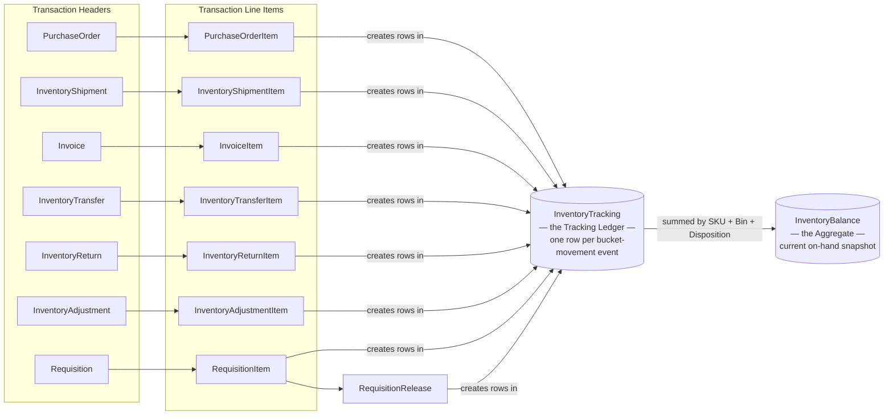

**`InventoryTracking`** is the transaction-level ledger. Every row represents a single inventory bucket-movement event, and is polymorphic: a `Transaction` reference points to whichever line item generated it (a PO line, a receipt line, an invoice line, a transfer line, and so on), disambiguated by a `Type` code (see §1.2).

**`InventoryBalance`** is the current-state aggregate. It is not independently maintained — it is always reconciled by summing every active `InventoryTracking` row grouped by SKU, Bin, and Disposition. Any tool that corrects inventory quantities is really doing two things: fixing the ledger, then recalculating the aggregate from it. These are separate operations even when they happen in the same script.

One nuance the diagram simplifies: `RequisitionItem` and `RequisitionRelease` each generate their own tracking rows independently — a "request" tracking row on the item itself, and a separate "release" tracking row when it's released to a bin. Both feed the same ledger; they aren't one row updated twice.

**Core columns, `InventoryTracking`:**

| Column | Type | Description |
|---|---|---|
| `Id` | bigint | Primary key, sequence-generated |
| `SkuReference.SkuId` / `.SkuType` | bigint / int | **The authoritative, canonical item reference.** A polymorphic pointer to the item's underlying catalog record — `SkuType = 1` → `Material`, `SkuType = 2` → `Equipment`. `.SkuId` equals that Material or Equipment record's own `Id`. |
| `Sku.Id` | bigint | **Legacy, nullable, being phased out.** A pre-migration direct FK that assumed a single, unambiguous SKU table. In current data it should always equal `SkuReference.SkuId` — see the note below for the rare cases where it doesn't. |
| `Bin.Id` | bigint | The tracking key — see §2.1 for why this is Bin rather than Location |
| `QuantityAvailable` | decimal | Ready to use right now |
| `QuantityOnHold` | decimal | Reserved, but not yet moved |
| `QuantityStaged` | decimal | Picked and in transit |
| `QuantityOnSite` | decimal | Delivered to a job, not yet billed |
| `QuantityOnOrder` | decimal | Ordered, not yet received |
| `Type` | int | Bucket-movement type — see §1.2 |
| `Transaction.Id` | bigint | Polymorphic FK to the source line item |
| `Date` | datetime | |
| `Disposition` | int | 0=Owned (Single), 1=Dual, 2=Consignment — see §1.6 |
| `Active` | bit | Soft-delete flag |
| `ImportId` | nvarchar | Traceability tag applied by bulk operations |

**None of these quantities represent a Location-level total.** For the vast majority of tenants this distinction is invisible, since each Location has exactly one Bin — but under Enhanced Bin Tracking (§2.1), a single Location can have multiple Bins, each with its own independent set of these quantities. Any tool that needs a true Location-level total must explicitly sum across every Bin belonging to that Location, not assume one row per Location.

`Sku.Id` is a legacy column, made nullable in a past schema migration; `SkuReference.SkuId`/`.SkuType` replaced it as the canonical, typed reference and is the field to use going forward. The two already agree in the overwhelming majority of records — a mismatch is a sign of migration-era legacy data, not active corruption. **Always join on `SkuReference.SkuId` + `SkuReference.SkuType`, never on `Sku.Id`.**

**Core columns, `InventoryBalance`:** identical quantity/Disposition columns, keyed by `SkuReference.SkuId` + `Bin.Id` + `Disposition` (no `Type`/`Transaction.Id` — it's an aggregate, not a ledger).

### 1.2 Inventory Quantity Buckets and Tracking Types

Inventory quantity for a given SKU/Bin moves between five buckets: **On Order**, **Available**, **On Hold (Reserved)**, **Staged**, and **On Site**. Each `InventoryTracking.Type` value represents a specific bucket-to-bucket movement:

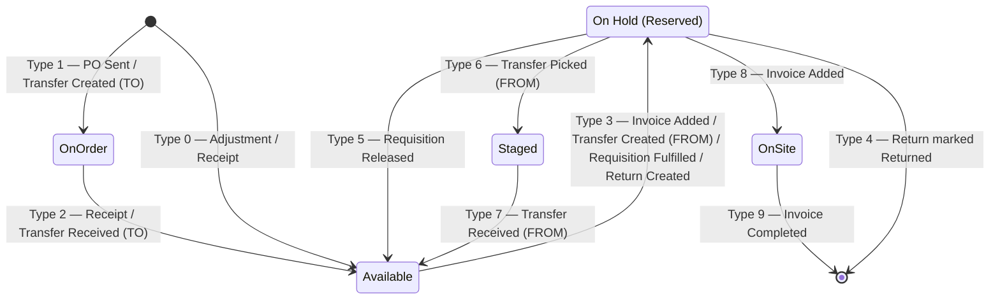

| Type | Movement | Triggering Events |
|---|---|---|
| 0 | ± Available | **Adjustment** created, **Receipt** created for extra (not ordered) items |
| 1 | + On Order | **Purchase Order** sent, **Transfer** created (destination) |
| 2\* | + Available, − On Order | **Purchase Order** received, **Transfer** received (destination) |
| 3 | − Available, + On Hold | **Invoice** item added, **Transfer** created (origin), **Requisition** fulfilled, **Return** created |
| 4 | − On Hold | **Return** marked Returned |
| 5 | + Available, − On Hold | **Requisition** released |
| 6 | − On Hold, + Staged | **Transfer** picked (origin) |
| 7 | − Staged | **Transfer** received (origin) |
| 8\* | − On Hold, + On Site | **Invoice** item added |
| 9 | − On Site | **Invoice** completed |

**Note on the asterisked rows above:** Types 2 and 8 have a genuinely different bucket movement in their custom form — not just a different trigger. The movements shown above are the *general* case; the custom variant moves different buckets entirely:

| Type | General Movement | Custom Movement | Custom Trigger |
|---|---|---|---|
| 2 | + Available, − On Order | + Available, − **Staged** | Reverse-transfer receipt (item returning from a Transfer to Job, not from On Order) |
| 8 | − On Hold, + On Site | − **Staged**, + On Site | Invoice item added *via* a Transfer to Job (the item was already Staged/picked by the transfer, not sitting On Hold) |

`Type` alone does not tell you which movement applies — you also need the source line's transfer/procurement linkage (populated → custom; null → general).

**On receipts specifically, Type 0 and Type 2 cover different cases.** An ordinary receipt against a PO line — decrementing On Order, incrementing Available — is `Type 2`, regardless of whether the received quantity matches, exceeds, or falls short of what was ordered on that line. `Type 0` applies only when there was no PO line at all for the item being received — an entirely unplanned/extra line item added directly to the receipt, with nothing on the PO to decrement On Order against.

**Today, the underlying schema tracks Reserved, Staged, and On Site as three separate columns** — `QuantityOnHold`, `QuantityStaged`, `QuantityOnSite` — **regardless of whether a given tenant's Transfers to Jobs feature gate is enabled.** This wasn't always true: before Transfers to Jobs was implemented, the schema itself only had a single "On Hold" bucket — Staged and On Site didn't exist as separate columns at all. The three-column structure was introduced as part of building that feature, and once introduced became permanent, tenant-independent schema — not something conditionally created per tenant. What the feature gate actually changes today is **what the UI shows**: tenants without Transfers to Jobs enabled only see a single aggregated "On Hold" value — the sum of all three columns — with no visibility into the breakdown. Tenants with Transfers to Jobs enabled see Reserved, Staged, and On Site as three distinct values. "Quantity Available to Pick" refers specifically to the Reserved portion (`QuantityOnHold`) alone, not the aggregate.

### 1.3 Identifiers and Audit Fields

All primary keys across the module are `bigint` values generated from a shared SQL Server sequence (`Int64-Generator`) — not GUIDs, not per-table identity columns. Every table follows a consistent audit pattern: `CreatedOn`, `CreatedBy.Id`, `ModifiedOn`, and `Active`.

### 1.4 Soft Delete

Deactivation (`Active = 0`), not hard deletion, is the standard pattern for removing a record across the entire module. Two exceptions perform literal deletes: a full tenant inventory wipe — an irreversible, exceptional operation with its own dedicated confirmation workflow, not a pattern any ordinary tool should follow — and the `ReplenishmentRequest` archival job, which is routine, scheduled, and expected behavior rather than exceptional (§6.3). Aside from these two, hard deletion should not be assumed anywhere else in the module.

### 1.5 Tenant Configuration

Tenant-level inventory settings are stored as a single JSON blob in `NamedValue` (`Name = 'Inventory.Configuration'`), not as discrete columns. Below is every known key, grouped by concept rather than as one flat list.

**Tracking start & core valuation**

| Key | Notes |
|---|---|
| `BeginningDate` | See the callouts below — this is load-bearing, not just a config value |
| `IsBeginningDateStarted` | Separate boolean — `BeginningDate` can be set to a future date, in advance of tracking actually starting |
| `AllowNegativeQuantityOnHand` | When enabled, items can still be used/consumed from a location that lacks sufficient quantity — the location's on-hand quantity goes negative rather than blocking the transaction |
| `AllowNegativeQuantityOnInvoice` | A different mechanism: lets a user enter a negative quantity directly on an invoice line (e.g., `-2` instead of `2`) — a form of contra-consumption that adds quantity back to the location. Not commonly recommended, but supported |
| `InventoryValuationMethod` | 0=Standard, 1=WeightedAverage, 2=WeightedAverageGranular. The last ties to `Warehouse.TrackGranularWeightedAverageCost`, §2.1 |
| `TrackingDisposition` | Tenant-level default, distinct from the per-row `Disposition` column — §1.6 |
| `WeightedAverageTrackByWarehouse` | Sub-toggle under `InventoryValuationMethod = 2` (Granular). Three levels: tenant selects Granular costing → enables tracking by warehouse here → each warehouse individually opts in via `TrackGranularWeightedAverageCost` (§2.1) |

**Serialization & Bin Tracking**

| Key | Notes |
|---|---|
| `IsSerializedTrackingEnabled` | §5.1 |
| `IsSerialNumbersBulkUploadEnabled` | When on, surfaces a Bulk Serialization tool in the Pricebook, via export/import |
| `IsBinTrackingEnabled` | Hardcoded — no FG dependency, available to every tenant. Confusingly similar-sounding but distinct from "Enhanced Bin Tracking" (§2.1/§1.10, closed-beta FG, 4 tenants): this key must be `true` for *either* legacy or Enhanced Bin Tracking to function, but the Enhanced Bin Tracking FG doesn't gate this checkbox's availability — it's selectable regardless of whether that FG is on |

**Consignment & Mobile Storage**

| Key | Notes |
|---|---|
| `IsConsignmentInventoryTrackingEnabled` | Requires the "Consignment Inventory" FG (§1.10) to be on — the FG makes this checkbox appear in Settings; the tenant then still has to manually enable it |
| `DefaultConsignmentBusinessUnitId` | §1.6 |
| `IsMobileStorageEnabled` | Requires the "Mobile Storage" FG (§1.10) to be on — same pattern: the FG surfaces the checkbox, manual enablement is a separate step |
| `IsWarehouseSitesEnabled` | Enables the "Site" value of `Warehouse.Type` — §2.1. Piggybacks on the **Granular WAC** FG (§1.10) rather than having its own dedicated FG — when Granular WAC is on, tenants get this checkbox and must manually enable it |

**Unit of Measure**

| Key | Notes |
|---|---|
| `EnableUnitOfMeasure` | Hardcoded — no FG dependency today. There was previously a gating FG, now sunset; the underlying capability is on for all tenants, similar in spirit to Dual's sunset (§1.6) |

**Replenishment (§6)**

| Key | Notes |
|---|---|
| `OnlyReplenishMax` | §6.4 |
| `RoundUpReplenishmentToWholeUom` | §6.4 |

**Purchase Order approval & behavior (§3.1)**

| Key | Notes |
|---|---|
| `SendUserNotificationsForPurchaseOrderReview` | Notifies the submitting user once a decision is made |
| `SendApproverNotificationsForPurchaseOrderRequest` | The approver-side counterpart to the row above |
| `PurchaseOrderApprovalField` | 0=PO Total, 1=PO Subtotal |
| `PurchaseOrderApprovalEditModel` | A mirror of the `InventoryPurchaseOrderApprovalTier` table, not the source of truth |
| `AllowCopyingPoItemsToInvoice` | Non-inventory items always copy to the invoice at $0 regardless of this setting; inventory items copy in at whatever `InventoryValuationMethod` (above) computes |
| `PreventOverReceivingPurchaseOrders` | §3.2 |
| `AllowRolloverPartiallyReceivedPurchaseOrders` | When enabled, partially received POs can be rolled over to a new PO from the PO action menu and during partial receipts; when off, unreceived items stay on the original PO — §3.1 |
| `DontAutomaticallyCreateBills` | §3.3 |

**Requisitions (§3.6)**

| Key | Notes |
|---|---|
| `BusinessUnitRequisitionMapping` | Per-Business-Unit default requisition mechanism — only two options, Install or Item Requisition (Service/Mobile isn't available here) — see §3.6, distinct from `Requisition.Type`. Requires both "Item Requisitions" and "Requisition-Closeout" (§1.10) to be on |
| `ProximityBasedFulfillmentEnabled` | Smart warehouse selection for Estimate-driven Requisitions — see §3.6. Also requires the separate `EnableProjectRequisitionsV2` feature flag |
| `MaintainEstimateCostThroughRequisition` | Flows Estimate cost through to the Requisition, PO, and Receipt — §3.6. Requires "Requisition-Closeout" (§1.10) |

**Transfers (§3.4) & Location Reassignment (§2.1)**

| Key | Notes |
|---|---|
| `AutoAssignTruckToJobTransfers` | §3.4. Requires "Transfers to Jobs" (§1.10) |
| `AutoUpdateInventoryLocationOnReassignment` | Dropdown/enum, not boolean — §2.1 |
| `PromptJobTransferOnPoReceipt` | Boolean — §3.4 |
| `RequireConfirmationBeforeReceivingTransfers` | §3.4 |

**Stock Optimizer — a separate feature, not related to Replenishment triggering**

| Key | Notes |
|---|---|
| `WosTrailingWeeks` | Default 8, configurable 4–52 — see below |
| `WosOverageWeeks` | Default 12 — see below |

**`BeginningDate` matters for every transaction type, not just one — and `IsInventory = true` alone is never sufficient proof that `InventoryTracking`/`InventoryBalance` rows exist for a line.** A transaction line can carry `IsInventory = true` for reasons unrelated to the full Inventory Module (see §3.1's "Quickbooks Advanced Inventory Enabled" exception, for one), and even on a tenant with the full Inventory Module enabled, a transaction dated before `BeginningDate` should not have tracking rows. This matters most in migration scenarios: a tenant that ran Purchasing-only (with `IsInventory = true` items and years of transaction history but zero `InventoryTracking` rows) and later enables full Inventory tracking must not have the system retroactively generate tracking rows for that pre-migration history — only for transactions dated on or after `BeginningDate`. Any tool reconstructing, backfilling, or validating tracking data must gate on the transaction's date against `BeginningDate`, in addition to checking `IsInventory` and module enablement — none of the three alone is sufficient.

**The same date-gating logic repeats one level down, at the individual item.** Whether a specific transaction *line* actually gets marked `IsInventory = true` (and gets real tracking rows) also depends on comparing the transaction's own relevant date against that specific item's `InventoryEnabledOn` (§2.2) — not just the tenant's `BeginningDate`. An item currently marked inventory-tracked does not retroactively become tracked on transactions dated before that item itself was enabled. Which date counts as "the transaction's relevant date" varies by type:
- **Invoice Items** (`InvoiceItem.DateCreated`, §8.3/§8.4): the "On Hold" date set on the invoice item's edit/add screen — which defaults to the job's first appointment date, and updates to default to the job completion date once the job is completed.
- **Purchase Orders:** the PO's own `Date` field (§3.1).

If that relevant date falls before the item's `InventoryEnabledOn`, the system adds the item to that transaction as non-inventory/untracked — even though the item is currently, and correctly, marked `IsInventory = true` in the pricebook today. The same principle applies to serialization; see §5.1.

**Ordering constraint: `BeginningDate` is the floor.** The tenant's `BeginningDate` establishes the earliest possible point tracking exists at all; every individual item's `InventoryEnabledOn` (and, for serialized items, `SerializedOn`) should be on or after that tenant-wide date — never before it. **One known exception:** tenants who ran "Quickbooks Advanced Inventory Enabled" (§3.1) before ever enabling full Inventory tracking can have items with `InventoryEnabledOn` dates predating the tenant's eventual `BeginningDate`, since those items were marked `IsInventory = true` under a completely different mechanism. Outside that specific migration path, an item-level enabled-date earlier than the tenant's `BeginningDate` is a data anomaly worth flagging, not an expected state.

**Several of these are one-way doors,** per the UI's own labeling ("this action is irreversible"): `IsSerializedTrackingEnabled`, `IsBinTrackingEnabled`, `IsMobileStorageEnabled`, `IsConsignmentInventoryTrackingEnabled`, `IsWarehouseSitesEnabled` (below), and `IsSubAccountEnabled` (accounting-adjacent, out of scope for its own mechanics — Appendix A). `EnableUnitOfMeasure` was previously asserted as irreversible too, but didn't appear in this particular UI capture — not contradicted, just not independently re-checked here. Any tool that touches these settings should treat them accordingly.

There is also a separate feature-gate system (distinct from this JSON config) governing specific workflows — for example, **"Disable Purchasing Approval Workflow"** is ON by default for all tenants, meaning most tenants never generate a PO approval request at all (see §3.1).

**Stock Optimizer** categorizes inventory health (Out of Stock Risk → Healthy → Aging → Old) using a Weeks of Supply calculation — a demand-forecasting/reporting feature, unrelated to what triggers a `ReplenishmentRequest` (§6.1's simple Available + On Order vs. Min comparison is unaffected by this). The formulas:

```
Weeks of Supply (WoS) = QuantityOnHand / Average Weekly Consumption
Average Weekly Consumption = Σ(InventoryTracking.QuantityOnSite, §1.1) / WosTrailingWeeks
WoS $ Overage = MAX(0, WoS − WosOverageWeeks) × Consumption × Cost
```

`WosTrailingWeeks` is the lookback period for the consumption average; `WosOverageWeeks` is the threshold beyond which supply counts as excess. Shorter trailing windows (4–6 weeks) suit seasonal/fast-changing demand; longer windows (12–16 weeks) smooth out volatility for slow-moving items.

Default health categories, each user-configurable in both name and threshold:

| Color | Category | Weeks of Supply |
|---|---|---|
| Red | Out of Stock Risk | 0–3 |
| Green | Healthy | 3–8 |
| Yellow | Aging | 8–15 |
| Orange | Old | 15+ |

### 1.6 Disposition

`Disposition` appears on both `InventoryTracking` and `InventoryBalance`:

| Value | Meaning |
|---|---|
| 0 | Owned (Single) |
| 1 | Dual |
| 2 | Consignment |

**Dual is sunset** — it can no longer be enabled on any tenant, though legacy Dual data may still exist and must be handled correctly. Dual applies only to Purchase Orders linked to a Job/Invoice, cascading to the Receipt, Invoice Item, and any Returns against that PO. A non-job PO item should never carry Dual, and job-linked doesn't imply Dual either — most job-linked PO items are Owned (Single).

A tenant-level `TrackingDisposition` setting (`Inventory.Configuration`, §1.5) tracks this at the tenant level, separately from the per-row `Disposition` column above. All tenants default to `0` (Single). Legacy tenants still on `1` (Dual) see a one-way switch in Inventory Settings to move to Single — consistent with Dual being sunset, this only ever goes one direction. Tenants already on `0` see no such option, since there's nothing to switch away from. Consignment is governed entirely separately, via its own checkbox tied to `IsConsignmentInventoryTrackingEnabled` (§1.5) — it is not a third value on `TrackingDisposition`.

**Disposition 0 (Owned/Single) is visible in the standard inventory UI; Disposition 1 (Dual) is not.** A mismatch — say, a Receipt landing on the wrong Disposition relative to its originating PO — splits what should be one offsetting pair of tracking rows across a visible bucket and an invisible one, so the drift goes unnoticed. **The rule: a transaction's tracking and its dependent transaction's tracking must always share the same Disposition.** The PO Item's Disposition is authoritative; Receipt and Invoice Item tracking should match it.

**Consignment** is a closed-beta feature enabled on a small number of tenants, gated by a dedicated "Consignment Inventory" feature gate — without it, `Disposition = 2` and its related transaction types (Adjustment Types 6/7) simply don't occur. It is not expected to require dedicated tooling in the near term. `DefaultConsignmentBusinessUnitId` (§1.5) is a Business Unit used during the **Consignment Conversion** process (the system-generated PO type, §2.1, for moving a Consignment-disposition item to Owned) — not detailed further here, consistent with this document's general treatment of Consignment.

### 1.7 Cancellation Reasons

A single `CanceledReason` enum is shared across `PurchaseOrder`, `InventoryCount`, `InventoryAdjustment`, `InventoryShipment`, `InventoryBill`, `InventoryReturn`, and `InventoryTransfer`:

| Value | Reason |
|---|---|
| 0 | Not Required |
| 1 | Duplicate |
| 2 | Accidental |
| 3 | Vendor Issue |
| 4 | Other |
| 5 | Job Canceled |
| 6 | Not Warranty |
| 7 | Warranty Rejected |

Purely inventory-internal transaction types — **Transfers, Adjustments, Counts** — only ever use the subset `{0, 1, 2, 4}`, since they have no vendor/job/warranty context. Types with that context (POs, Bills, Shipments, Returns) can use the full range.

### 1.8 Procurement/Source Lineage — Three Distinct Patterns

Any line item can be traced along two axes: why it exists (demand) and how it was fulfilled (supply). Three different table designs across the schema answer this — a real inconsistency, not a documentation gap. Any tool tracing lineage needs to know which design applies to the table it's reading.

| Pattern | Shape | Used on |
|---|---|---|
| **A — polymorphic, per-type columns** | One `ProcurementSource.SourceType` discriminator (values below), plus a dedicated nullable FK per possible source: `TransferItemId`, `PurchaseOrderItemId`, `RequisitionItemId`, `ProcuredFromEstimateItem.Id` (legacy name `EstimateItemId`, phased out — see below) | `InvoiceItem`, `InventoryAdjustmentItem` |
| **B — discrete named FKs, no discriminator** | Independent columns, no flag: `TransferItem.Id`, `PurchaseOrderItem.Id`, `InvoiceItem.Id`, `EstimateItem.Id` | `RequisitionItem` |
| **C — polymorphic, single generic reference** | One `Type` discriminator, one `Id`, and a denormalized `Name` | `ItemRequisition` (`ProcurementSource`) |

A and C are both polymorphic — a discriminator identifies which source applies — differing only in whether there's one dedicated column per source (A) or one shared target column (C). B has no discriminator; the populated column *is* the answer.

**`ItemRequisition.SourceReference` vs. `ProcurementSource` (on `InvoiceItem`)** are easy to conflate but answer different questions:

| | `SourceReference` | `ProcurementSource` |
|---|---|---|
| Lives on | `ItemRequisition` | `InvoiceItem`, closeout/costing |
| Answers | Why the requisition exists (demand) | How the item was fulfilled (supply) |
| Values | `ItemRequisitionType`: 0=ServiceAgreementVisit, 1=RecurringServiceEvent, 2=QuantityToOrder, 3=SoldEstimateItem (obsolete) | Discriminator + PO/Transfer/Requisition/Estimate item FKs |

Example: a requisition created from a Service Agreement Visit carries `SourceReference.Type = ServiceAgreementVisit`. If that need is later fulfilled via a Purchase Order, the resulting `InvoiceItem.ProcurementSource` points to that PO line — same item, two fields recording two different halves of its lineage.

**`ProcurementSourceType` enum**, from source — `0=Vendor, 1=Truck, 2=Warehouse, 3=MobileStorage`. **This applies specifically to `ItemRequisition.ProcurementSource.Type` (Pattern C, above) — it does not apply to any other table, and should not be assumed to.** It answers *where physically* the item was procured from (an external Vendor, or transferred in from an internal Truck/Warehouse/MobileStorage).

**Pattern A's discriminator is a genuinely different field with genuinely different values, from source: `ProcurementSource.SourceType`.**

| Value | Meaning |
|---|---|
| 0 | None |
| 1 | Estimate |
| 2 | RequisitionFromLocation |
| 3 | RequisitionPurchaseOrder |
| 4 | PurchaseOrder |
| 5 | Transfer |

This answers *what workflow/source path* produced the line item — a different question than `ProcurementSourceType`'s "where physically." The two are easy to confuse by name alone but are unrelated enums on unrelated fields:
- `ProcurementSourceType` → the physical source class, for `ItemRequisition` only (Pattern C)
- `ProcurementSource.SourceType` → the procurement/closeout origin, for `InvoiceItem`/`InventoryAdjustmentItem` (Pattern A)

`SourceType = 0` (None) matches the "standalone line, no source" case; `SourceType = 1` (Estimate) matches the "from a Sold Estimate" case — exactly the 0/1 boundary already observed against `EstimateItem.Id`. `SourceType` **has** been expanded well beyond that original binary, with four more values covering Requisition (split into two sub-paths — fulfilled from an internal Location vs. from a Purchase Order), standalone Purchase Order, and Transfer sourcing.

**`EstimateItem.Id` itself is being phased out, replaced by `ProcuredFromEstimateItem.Id`.** No production record dated after **January 1, 2026**, on any tenant, uses `EstimateItem.Id` — all have migrated to `ProcuredFromEstimateItem.Id` instead. This is the same legacy-field-replacement pattern that recurs throughout this document (`Sku.Id` → `SkuReference.SkuId`, §1.1; `ProcuredFrom.Id` → `ProcurementSource.PurchaseOrderItemId`, §3.5) — a specific cutoff date makes this one more precise than most.

This also parallels — but is not the same enum as — `ReplenishmentSource.Type` (§6.3: `1=Location, 2=Vendor`, with Location left generic). `ProcurementSourceType` gives more granularity by splitting Location into Truck/Warehouse/MobileStorage individually, and uses different numbering entirely.

### 1.9 Financial Impact

Not every transaction type carries direct financial/GL impact. **Returns, Purchase Orders, Bills, Adjustments, and Transfers** do. **Requisitions and Counts do not carry direct financial impact themselves** — the transactions generated *from* them (Adjustments, Transfers, POs) carry the actual impact. This is a useful lens for scoping the rigor a given tool needs: tools that only touch Requisitions or Counts in isolation may not need the same financial safeguards as tools touching the directly-impactful types.

### 1.10 Feature Gates Governing Inventory Behavior

Much of what a tenant can do — and what data actually gets generated — is governed by feature gates, not just the JSON tenant configuration in §1.5. This table is the central reference; each row's detail lives in the section noted.

| Feature Gate | Governs | Detail |
|---|---|---|
| **Purchasing Module** | Simple purchasing with no inventory tracking at all | §3.1 |
| **Quickbooks Advanced Inventory Enabled** | Adds an "Is Inventory" checkbox to Material/Equipment pricebook items for tenants on the Purchasing Module — lets `IsInventory = true` propagate onto those items and their transaction lines purely for QuickBooks export/QOH purposes, without ever generating `InventoryTracking`/`InventoryBalance` rows | §3.1 |
| **Inventory Module** | Full inventory tracking | throughout |
| **Requisition-Closeout** | Install Requisition closeout workflow (incl. Adjustment Type 2) | §1.5, §3.5 |
| **Item Requisitions** | The standalone `ItemRequisition` entity | §1.5, §3.6 |
| **Enable Requisition Workflow for Service Job** | Service/Mobile Requisition workflow | §3.6 |
| **Transfers to Jobs** | Item Overview UI, Requisition workflow, and Standalone Transfer to Jobs | §1.2, §1.5, §3.4 |
| **Consignment Inventory** | Disposition 2 (Consignment) tracking and its related transaction types | §1.5, §1.6 |
| **Enhanced Bin Tracking** | Multiple bins per Location | §2.1 |
| **Staging Picklists** | Adds two tools: Picklists (item lists generated for a Job/Project) and Technician Returns (surfaces truck stock outside replenishment template limits, for Transfer or Return to Vendor) | §3.4 |
| **Warranty Parts Tracking** | Brings the warranty module into Inventory and Purchasing | §3.6 |
| **Disable auto-item consumption with TTJ** | Whether TTJ-received items are auto-consumed onto invoices automatically (off, default) or require manual closeout (on) | §3.4 |
| **Granular WAC** | Separate Weighted Average Cost per warehouse/mobile storage, rather than one tenant-wide value | §1.5, §2.1 |
| **Mobile Storage** | The `MobileStorage` location type itself | §1.5, §2.1 |
| **Inventory Transfers Between Tenants** | Cross-tenant inventory movement for Enterprise Hub Network tenants, via a dedicated `IntracompanyTransfer` record on each side, each generating its own tenant-local Adjustment (Type 9/10) | §3.5 |

---

## 2. Location & Master Data

### 2.1 Inventory Locations and Bins

Warehouse, Truck, and MobileStorage are collectively referred to as **Inventory Locations**. A Warehouse may have sub-warehouses (a parent/child hierarchy via `ParentWarehouse.Id`); a Truck or a MobileStorage **must always be assigned to a Warehouse** — neither can exist independently.

**Critically, inventory tracking is keyed on Bin, not on Location.** Every `InventoryTracking` and `InventoryBalance` row references `Bin.Id`, never a Location directly. Location is the parent concept a Bin belongs to, but the actual tracking ledger and balance are computed per Bin.

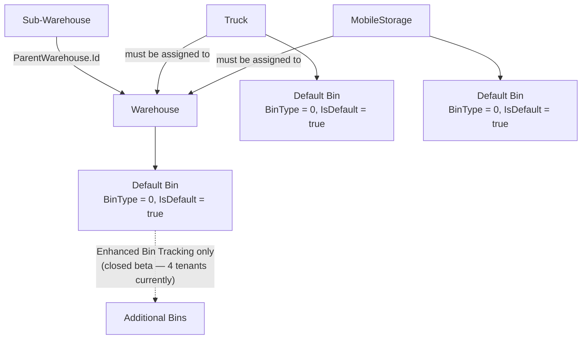

**Every Inventory Location has at least one main Bin.** The first time an inventory transaction is created for a given SKU at a given Location, the system auto-generates that Location's main Bin record — always `IsDefault = true` and `BinType = 0`. For the vast majority of tenants, this is the *only* Bin that Location will ever have, and tenants have no direct control over Bin type at all.

**A Location can have more than one Bin only under "Enhanced Bin Tracking"** — a dedicated feature gate, currently a closed-beta MVP with only four real production tenants using it. Non-default / non-zero `BinType` values exist specifically for this feature. Technically this applies to any Inventory Location type — Warehouse, Truck, or MobileStorage — but in practice it's used almost exclusively for Warehouses. **Where Enhanced Bin Tracking is enabled, a single Inventory Location can have multiple Bins — meaning multiple independent tracking ledgers and balances for what is conceptually one location.** Any tool should still treat Location as a meaningful grouping/parent concept, but must never assume one Bin per Location as a hard invariant — only as the default-case behavior for ordinary tenants.

**`Warehouse`**

```sql
-- Inventory Location type 1 of 3. Can be a parent to sub-warehouses; the top-level default for most tenants.
Id
Name
Type                          -- Standalone / Site / SubWarehouse
ParentWarehouse.Id            -- populated for sub-warehouses
DefaultBin.Id                 -- FK to this Warehouse's auto-generated main Bin, see below
DefaultBusinessUnit.Id
Template.Id                   -- the Replenishment Template monitoring this location — see §6; many-to-one, several locations can share one Template
TrackGranularWeightedAverageCost   -- per-warehouse opt-in; only meaningful when the tenant has InventoryValuationMethod = 2
                                   -- and WeightedAverageTrackByWarehouse enabled — see §1.5 for the full three-level hierarchy
Active
```

**`IsWarehouseSitesEnabled`** (§1.5) confirms the mechanism behind `Warehouse.Type = Site` above — it groups multiple warehouses into a "Site" for shared cost tracking and classification. This setting is a one-way door once turned on.

**`AutoUpdateInventoryLocationOnReassignment`** (§1.5) governs what happens to a Truck's inventory location when its assigned technician gets reassigned to a different job. It's a dropdown/enum, not a simple boolean — only one value is independently known: `Disabled`, which surfaces a manual confirmation pop-up on the Dispatch Board asking whether to update the inventory location, rather than doing it automatically. The other possible values aren't known.

**`Truck`** — must always be assigned to a Warehouse

```sql
-- Inventory Location type 2 of 3. A mobile location tied to a specific technician/vehicle.
Id
Name
Warehouse.Id
DefaultBin.Id                 -- FK to this Truck's auto-generated main Bin, see below
Template.Id                   -- the Replenishment Template monitoring this location — see §6
Active
```

**`MobileStorage`** — must always be assigned to a Warehouse, regardless of type; only exists under the Mobile Storage feature gate (§1.10)

```sql
-- Inventory Location type 3 of 3. The newest location type; represents Kits or On-site storage.
Id
Name
Type              -- 0 = Kit (also assignable to Trucks), 1 = On-site (also assignable to Projects/service locations)
DefaultBin.Id                 -- FK to this MobileStorage's auto-generated main Bin, see below
Template.Id                   -- the Replenishment Template monitoring this location — see §6
Active
```

**`Bin`**

```sql
-- The actual tracking key — every InventoryTracking/InventoryBalance row references Bin.Id, not Location.Id.
Id
Name
Location.Id       -- polymorphic FK: the Warehouse, Truck, or MobileStorage this Bin belongs to
TemplateBin.Id    -- links to a bin template configuration; not further detailed in this document
BinType           -- 0 for the default bin on ordinary tenants; other values (Generic/Primary/Overstock/MixedUse)
                  -- apply only under Enhanced Bin Tracking
IsDefault
Active
CreatedBy.Id
CreatedOn
ModifiedOn
ImportId
```

`PurchaseOrderType`, `TransferType`, and `InventoryReturnType` are **tenant-configurable master data, not fixed system enums** — a tenant can create its own additional types from the UI, each with its own name and behavior flags. Any tool identifying "is this a Standard PO" or "is this a Transfer-to-Job type" must resolve behavior via the tenant's actual records (by name or by boolean flag), not a hardcoded ID. `MobileStorageType` is one exception — fixed and consistent across tenants (see table above).

Within each, a specific subset of values are **system-generated only** — a user cannot create a record and pick these from the type picker; the system assigns them automatically as a side effect of another action. Everything else is user-selectable and manual, including tenant-created custom names — though a few manual values are pre-seeded defaults that can't be deactivated from the UI, called out individually below.

**`PurchaseOrderType`:**

| Type Name | Manual or System | Notes |
|---|---|---|
| Special Order | Manual | Default type, automatically available once the Purchasing or Inventory Module is enabled; cannot be deactivated from the UI |
| Supply House Run | Manual | Default type, automatically available once the Purchasing or Inventory Module is enabled; cannot be deactivated from the UI |
| Service Requisition | System-generated | Generated via a Service (Mobile) Requisition |
| Replenishment | System-generated | Generated when a PO is created from a Replenishment |
| Item Requisition | System-generated | Generated via an Item Requisition |
| Install Requisition | System-generated | Generated via an Install Requisition |
| Consignment Conversion | System-generated | Generated when a Consignment-disposition item is moved to Owned |
| *(any tenant-created name)* | Manual | Tenants can create additional custom PO types from the UI |

**Four additional legacy values exist on `PurchaseOrderType` for some (not all) tenants, but are inert today:** `NonJobNoTruckRestock` ("Non Job No Truck Restock"), `NonJobRestock` ("Non Job Restock"), `LegacyInvoice` ("Legacy Invoice"), and `LegacyNonJob` ("Legacy Non Job"). These predate a tenant's move to the Purchasing/Procurement module, aren't present on every tenant, and are neither visible nor selectable from the UI. A tool enumerating `PurchaseOrderType` values may encounter them in historical data on some tenants; they play no role in current PO creation or workflow.

**`TransferType`:**

| Type Name | Manual or System | Notes |
|---|---|---|
| Standard | Manual | Default type, automatically available once the Inventory Module is enabled; cannot be deactivated from the UI |
| Replenishment | System-generated | Generated automatically via Replenishment |
| Install Requisition | System-generated | Generated via an Install Requisition |
| Item Requisition | System-generated | Generated via an Item Requisition |
| Service Requisition | System-generated | Generated via a Service (Mobile) Requisition |
| Reverse Job Transfer | System-generated | Generated **only** when a Transfer-to-Job (Service Location) item is removed from an invoice — this is the actual name behind the "custom Type 2" reverse-transfer receipt discussed in §1.2, not a general-purpose reversal mechanism |
| *(any tenant-created name)* | Manual | Tenants can create additional custom Transfer types from the UI |

**`InventoryReturnType`:** columns `Id`, `Name`, `AutomaticallyReceiveVendorCredit`, `IncludeInSalesTax`, `IsDefault`, `IsDefaultForConsignment`, `Active`, `CreatedOn`, `CreatedBy.Id`, `ModifiedOn`, `ImportId`.

| Type Name | Manual or System | Notes |
|---|---|---|
| Auto Receive Vendor Credit | Manual | Default tenant type |
| Return to Vendor | Manual | Default tenant type |
| Return to Warehouse | Manual | Default tenant type. Generates a matching `InventoryAdjustment.Type = 5` ("Return to Warehouse," §3.5) — a direct, name-matched link, not just a loose conceptual connection. |
| Requisition | System-generated | Assigned automatically when a Return to Vendor is created from the Requisition Closeout screen |
| Consignment | Manual | Default tenant type |
| *(any tenant-created name)* | Manual | Tenants can create additional custom Return types from the UI |

**Two further exceptions to the "tenant-configurable" rule, in opposite directions:**
- **`IntracompanyTransferType` is fully closed, not extensible** — exactly two values, `0 = Outgoing` and `1 = Incoming`, and no additional types can ever be created here (see §3.5 for the `IntracompanyTransfer` mechanism this governs).
- **`InventoryAdjustment.Type` is also fully closed** — hardcoded, no UI settings, no tenant customization, no additional values possible. The table in §3.5 is the complete, exhaustive list.

**Receipts, Bills, and other transaction tables have no `Type` concept at all** — this typing pattern only applies to Purchase Orders, Transfers, Returns, Adjustments, and Intracompany Transfers.

**`TransferType`** carries a `TransferItemsToJobs` boolean. The relationship to actual transfer behavior is one-directional: a transfer where `FromBin.Id = ToBin.Id` (an actual Transfer-to-Job) *requires* its type to have `TransferItemsToJobs = true` — but a `TransferItemsToJobs = true` type can still be used for an ordinary between-location transfer. **The reliable way to identify an actual Transfer-to-Job instance is the bin-equality check (`FromBin.Id = ToBin.Id`), not the type flag alone.**

### 2.2 `InventorySku`, `Material`, and `Equipment`

An item's core identity lives in one of two pricebook catalog tables — **`Material`** or **`Equipment`** — not in `InventorySku` itself. **`InventorySku` is universal, not conditional on inventory tracking:** every `Material`/`Equipment` record gets a companion `InventorySku` row automatically on creation, including items created as non-inventory from the start — `IsInventory` simply stays `false` on that row. All three tables, along with `InventoryTracking`/`InventoryBalance` (§1.1, populated only for inventory-tracked items), resolve the same item via the same polymorphic pair: `SkuReference.SkuId` (equal to the underlying `Material.Id` or `Equipment.Id`) and `SkuReference.SkuType` (1=Material, 2=Equipment).

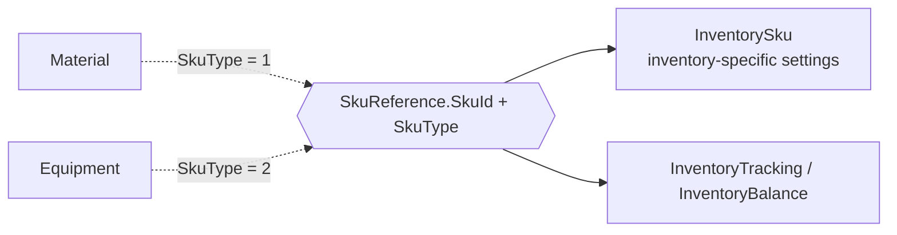

`InventorySku.Id` is its own surrogate key for that row — it is **not** the same value as `SkuReference.SkuId`, which is the FK pointing back to the underlying `Material`/`Equipment` record.

`Material` and `Equipment` are large catalog/pricebook tables (pricing, commission, tax, GL account mapping, and — for Equipment — physical specs like dimensions and manufacturer warranty). Only a handful of their columns are directly relevant to inventory tracking: `IsInventory`, `InventoryEnabledOn`, `IsSerialized` (serial number tracking — see §5), `SerializedOn`, `Cost`, `PrimaryCost`, `PrimaryVendor.Id` (default vendor source for Replenishment — see §6), `UnitOfMeasure`, `IsChemical`/`EpaNumber` (Material only), `BusinessUnit.Id`. The rest of their schema is out of scope for this document.

**At the item level, `IsInventory` cannot be reversed once enabled** — there is no equivalent of "un-inventorying" an item from the pricebook. This is a firmer rule than serialization, which *can* be reversed per item — see §5.1.

**`InventorySku`** — inventory-relevant columns

```sql
-- 1:1 companion to every Material or Equipment record, created automatically regardless of IsInventory.
Id
Name
Code
Description
SkuReference.SkuType / .SkuId
IsInventory                        -- master switch: whether this item is inventory-tracked at all
InventoryEnabledOn                -- canonical timestamp — prefer this over DateInventoryEnabled
DateInventoryEnabled              -- migrated/reporting-oriented duplicate, see note below
InventoryEnabledBy.Id
IsSerialized                       -- enables serial number tracking for this item — see §5
SerializedOn                      -- canonical timestamp — prefer this over DateSerialized
DateSerialized                    -- migrated/reporting-oriented duplicate
SerializedEnabledBy.Id
HasUnitOfMeasure                   -- enables unit-of-measure tracking for this item — see §7
UnitOfMeasureEnabledOn            -- canonical timestamp
DateUnitOfMeasureEnabled          -- migrated/reporting-oriented duplicate
UnitOfMeasureEnabledBy.Id
IsConsignment                      -- flags this item as eligible for Consignment tracking, Disposition 2 — see §1.6
DateConsignmentEnabled
ConsignmentEnabledBy.Id
IsAutoConsumed                    -- auto-expensed on arrival rather than tracked as on-hand — see §3.4
IsAutomaticallyReplenished         -- ties to Replenishment Templates — see §6
IsChemical                        -- EPA-regulated chemical/hazmat tracking
EpaNumber
Active
```

**On the paired date columns** (`{Feature}EnabledOn` vs. `Date{Feature}Enabled`, appearing for Inventory, Serialization, and Unit of Measure): these represent the same underlying business event through two different representations with different lineage — `…EnabledOn` is the canonical domain timestamp, `Date…` is a migrated/reporting-oriented column, and the two can diverge due to timezone normalization or date-only truncation during past schema evolution. **For new operational logic, prefer the `…EnabledOn` fields.** Watch for a `1900-01-01` sentinel value on either column meaning "never enabled" — treat it as equivalent to `NULL`, not a real date.

**Example of this divergence:** on `InventorySku`, `DateInventoryEnabled` stores date-only precision (e.g., `2026-08-29 00:00:00`), while `InventoryEnabledOn` stores the actual action timestamp (e.g., `2026-08-29 10:47:08`) — and that same precise timestamp is mirrored on the source `Material`/`Equipment` record's own `InventoryEnabledOn` when the item is marked `IsInventory`. This makes `…EnabledOn` the more precise, cross-table-consistent value.

**`InventoryAssembly` and `InventoryAssemblyItem`** — a kit/bundle concept that applies to **both inventory and non-inventory items alike**, unlike Templates and Counts, which are inventory-tracked-only.

```sql
-- InventoryAssembly: a named bundle of items.
Id
Name
LastUsed
Active
CreatedBy.Id
CreatedOn
ModifiedBy.Id
ModifiedOn
ImportId
```

```sql
-- InventoryAssemblyItem: one SKU/quantity within an Assembly.
Id
Assembly.Id
SkuReference.SkuType / .SkuId   -- the item — see §1.1 for SkuReference vs. Sku.Id
Quantity
UnitOfMeasure.Id                -- see §7
Active
CreatedBy.Id
CreatedOn
ModifiedBy.Id
ModifiedOn
ImportId
```

---

## 3. Transaction Types

### 3.1 Purchase Orders

Purchase Orders don't require the full Inventory Module to exist at all — a separate **Purchasing Module** feature gate supports "Simple Purchasing" for tenants without inventory tracking enabled. For most such tenants, `PurchaseOrderItem.IsInventory` is always false and no `InventoryTracking` rows result.

**One documented exception:** a separate feature gate, **"Quickbooks Advanced Inventory Enabled,"** adds an "Is Inventory" checkbox directly on Material/Equipment pricebook items for Purchasing-Module-only tenants. Checking it sets `IsInventory = true` on the item (both `Material`/`Equipment` and `InventorySku`) purely so its quantities export to QuickBooks and affect QOH there, via QuickBooks' own "Inventory Batch Report" mechanism — this lets QuickBooks deplete inventory as invoices are created, rather than waiting for them to post. Once an item is flagged this way, `IsInventory = true` propagates onto `PurchaseOrderItem` (modeled here) and onto other transaction lines that reference the item, such as Invoice items — those aren't modeled in this document, but the same rule applies: **none of this ever generates `InventoryTracking` or `InventoryBalance` rows.** This is one instance of a general rule — see §1.5 for why `IsInventory = true` is never sufficient on its own, across any transaction type, to assume tracking data exists.

The PO/PO-Item schema below applies either way.

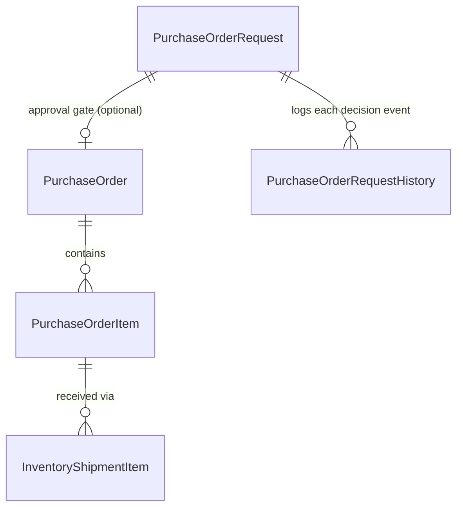

**`PurchaseOrder.Status`:**

| Value | Status |
|---|---|
| 0 | Pending / Draft |
| 1 | Exported |
| 2 | Sent |
| 3 | Partially Received |
| 4 | Received |
| 5 | Cancelled |
| 6 | Pending Approval |

**`PurchaseOrder.GroupingOption`** governs how a *Replenishment-generated* PO groups its source demand. **Non-Replenishment POs always have `GroupingOption = 0`** — the value only carries the meanings below when the PO actually originated from Replenishment. Which set of meanings applies depends on whether the **Purchasing Module** feature gate (§1.10) is enabled:

| Value | Meaning | Purchasing Module |
|---|---|---|
| 0 | Group by Vendor | OFF — Legacy Truck Replenishment path |
| 1 | Group by Vendor, Truck | OFF — Legacy Truck Replenishment path |
| 2 | Group by Vendor, Truck & Job | OFF — Legacy Truck Replenishment path |
| 3 | Group by Vendor & Warehouse | ON |
| 4 | Group by Vendor & Location | ON |
| 5 | Group by Vendor & Location & Job | ON |

**Legacy Truck Replenishment** confirms that Replenishment-driven PO generation predates the Purchasing Module feature gate itself — tenants with the Purchasing Module *not* enabled at all still generate Replenishment POs, just via this legacy grouping path with its own value range (0–2), distinct from the modern path's range (3–5).

**Value `0` is overloaded** — it means "Group by Vendor" for a legacy Replenishment PO, but is also the fixed value on any non-Replenishment PO regardless of Purchasing Module state. `GroupingOption = 0` alone does not tell you whether a PO came from legacy Replenishment or isn't a Replenishment PO at all — confirm the PO's actual origin separately before relying on this value.

**`PurchaseOrderItem.Status`:** 0=Pending, 1=Sent, 2=Received, 3=Cancelled.

**Approval workflow.** A separate table, `PurchaseOrderRequest`, holds a bidirectional 1:1 link to `PurchaseOrder` and represents the approval gate. `PurchaseOrder.PurchaseOrderRequest.Id` is nullable — most POs never have one. This entire workflow is conditional on a feature gate, **"Disable Purchasing Approval Workflow,"** which is **ON by default for all tenants** — meaning, by default, the approval workflow is *disabled* and most tenants' POs never reach `Status = 6` or generate a `PurchaseOrderRequest` row at all. Only tenants with this FG explicitly turned off use the approval process.

**What actually decides `IsAutomaticDecision`: Purchase Order Approval Tiers.** Tenants configure dollar-range tiers (e.g., Tier 1 = $0–$999.99, Tier 2 = $1,000–$9,999.99, and so on, up to an open-ended top tier), based on either the PO's `Total` or `Subtotal` per tenant setting, and assign each user or role a maximum tier. When a user submits a PO whose amount falls within their assigned tier's range, the request auto-approves (`IsAutomaticDecision = true`) and the PO proceeds immediately. When the PO's amount exceeds what that user's tier allows, the request goes to Pending Approval instead (`IsAutomaticDecision = false`), requiring a user whose assigned tier covers that amount to manually approve or reject it.

The tiers themselves live in a dedicated table, `InventoryPurchaseOrderApprovalTier`:

```sql
-- One row per Approval Tier.
Id
FromAmount
ToAmount                 -- NULL on the top tier, meaning "and above"
Active
CreatedBy.Id
CreatedOn
ModifiedOn
ImportId
```

The `Inventory.Configuration` JSON's `PurchaseOrderApprovalEditModel.EditTierModels` mirrors these same rows (`Id`s match against real data) — denormalized for the tier-editing UI; `InventoryPurchaseOrderApprovalTier` is the source of truth.

`PurchaseOrderApprovalField` is the PO Total vs. Subtotal toggle from the screenshot above — `0=PO Total, 1=PO Subtotal`. Two separate notification settings exist for this workflow: `SendUserNotificationsForPurchaseOrderReview` (notifies the submitting user once a decision is made) and `SendApproverNotificationsForPurchaseOrderRequest` (notifies approvers when a request needs their review) — both default to off.

`PurchaseOrderRequest` holds the *current* state of the approval gate; a separate table, `PurchaseOrderRequestHistory`, is the append-only audit trail of every decision event (submission, approval, rejection) against that request — distinct records, not the same data twice.

**`PurchaseOrderRequest`**

```sql
-- Current-state record: one per PurchaseOrder, the approval gate itself.
Id
PurchaseOrder.Id
Number
Status                   -- 0=Pending Approval, 1=Approved, 2=Rejected
IsAutomaticDecision       -- true if the submitting user's Approval Tier covered the PO amount (auto-approved); false if it exceeded their tier and required manual review — see above
LastDecisionBy.Id
LastDecisionDate         -- NULL while still pending; populated once a decision (approve or reject) has been rendered
Active
```

**`PurchaseOrderRequestHistory`**

```sql
-- Append-only audit trail, one row per decision event on a PurchaseOrderRequest.
Id
Request.Id               -- FK to PurchaseOrderRequest
Decision                 -- 0=Submitted (not a decision), 1=Approved, 2=Rejected
RejectionReason          -- null=not rejected, 0=Cost is too high, 1=Wrong Vendor, 2=Other
Comment
IsAutomaticDecision
CreatedOn
CreatedBy.Id
Active
```

**Header:** `PurchaseOrder`

```sql
-- Header record: the PO document itself. Applies whether or not the tenant has full Inventory
-- tracking enabled — Simple Purchasing tenants use this same schema, see above.
Id
Number
UniqueNumber
PoVendor.Id              -- authoritative vendor reference; a separate free-text Vendor column exists but is not authoritative
Invoice.Id               -- job invoice this PO's cost is factored into, when job-attached
Project.Id
Requisition.Id
InventoryLocation.Id
BusinessUnit.Id
Type.Id                  -- FK to PurchaseOrderType — tenant-configurable + system-generated values, §2.1
Amount
Tax
Shipping
Date
DateRequired
GroupingOption           -- how Replenishment-generated POs are grouped; see below — meaning depends on Purchasing Module state
VendorInvoiceNumber      -- same conceptual value as the one on InventoryBill; the two can technically diverge
SendStatus                -- 0=Pending, 1=InProgress, 2=Sent, 3=Failed, 4=Received, 5=Rejected, 6=OpenedEmail
SendingMethod              -- 0=Manual, 1=EmailAsExcel, 2=EmailAsPdf, 3=EmailAsPdfRollupView, 4=Electronic,
                           -- 5=MarkAsSent, 6=EmailAsExcelAndPdf, 7=VendorPortal — see below for how this
                           -- interacts with SendStatus
Job.Id                    -- job this PO is attached to, automatically or manually; see AllowCopyingPoItemsToInvoice, §1.5
Truck.Id                  -- populated when the PO is destined for a truck rather than a warehouse
RolledOverFromPurchaseOrder.Id   -- unfulfilled-quantity rollover lineage, same pattern as InventoryTransfer; gated by AllowRolloverPartiallyReceivedPurchaseOrders, §1.5
LandedCostSettings.LandedCostMethod
Active                    -- 0 when the PO is Cancelled (Status = 5, §3.1) — cancellation reliably sets this
```

**Line:** `PurchaseOrderItem`

```sql
-- Line record: one SKU/quantity on the PO.
Id
PurchaseOrder.Id
SkuReference.SkuId       -- the item — see §1.1 for SkuReference vs. Sku.Id
Quantity
Cost
TotalCost
IsInventory              -- true only for full Inventory Module tenants, or via the Quickbooks Advanced
                         -- Inventory Enabled exception (above) — never sufficient alone to assume
                         -- InventoryTracking rows exist, see §1.5
Bin.Id
InventoryLocation.Id
ItemRequisition.Id       -- mutually exclusive with RequisitionItem.Id below — see §3.6
RequisitionItem.Id       -- mutually exclusive with ItemRequisition.Id above — see §3.6
RolledOverFromItem.Id    -- unfulfilled-quantity rollover lineage
RollOverQuantity         -- the quantity carried over from the prior PO line
ConsignmentSource.EntityId / .SourceType   -- polymorphic consignment origin, §1.8-style pattern
SourceInvoiceItemId      -- links back to the Invoice Item that triggered this PO line, for job-driven material requests — see §1.8
Active                    -- 0 when the line is Cancelled (Status = 3, above)
```

**`SendingMethod` and `SendStatus` interact rather than duplicate each other.** `SendingMethod` is the channel — how the PO was or will be delivered. `SendStatus` tracks the process/result of that delivery over time, and its starting point depends on the method: `Electronic` and `VendorPortal` typically begin at `InProgress`, since those channels involve an actual multi-step send process; simpler methods (e.g., `EmailAsExcel`, `EmailAsPdf`) can go straight to `Sent`. From there, vendor-side responses can move `SendStatus` further, to `Received`, `Rejected`, or `OpenedEmail`.

### 3.2 Receipts

**Header:** `InventoryShipment`

```sql
-- Header record: the receipt document. Always tied to a PO — see below.
Id
Number
PurchaseOrder.Id         -- always populated — see "Always tied to a PO" above
Bill.Id                  -- the Bill this receipt was reconciled into, if any — see §3.3
DateReceived
VendorReceiptNumber
Total
Tax
Shipping
OtherCosts               -- header-level total; allocated per line as AllocatedOtherCosts below
Active
```

**Line:** `InventoryShipmentItem`

```sql
-- Line record: one SKU/quantity received.
Id
InventoryShipment.Id
PurchaseOrderItem.Id     -- nullable — null for extra/unplanned items added to the receipt with no PO line, see below
SkuReference.SkuId / .SkuType   -- the item — see §1.1 for SkuReference vs. Sku.Id; the only item reference for Type 0 receipts, which have no PO line to inherit it from
Bin.Id
Quantity
Cost
UnitOfMeasureCost   -- see §7
TotalCost
FullyLandedUnitCost      -- landed-cost allocation
AllocatedOtherCosts
AllocatedTax
AllocatedShipping
Active
```

**A Receipt cannot exist without a Purchase Order.** This is a hard business rule, not merely typical usage — but it applies at the header level. Individual receipt items are different: an `InventoryShipmentItem` can exist with `PurchaseOrderItem.Id = NULL`, for an extra or unplanned item added directly to the receipt that was never on the PO. This is the item-level case behind `Type 0` tracking (§1.2) — a receipt line with no PO line to reconcile against.

Receipt tracking's `QuantityOnOrder` value is *derived*, not directly settable — it's calculated from the PO line's original quantity minus all prior receipts against that line, in chronological order, handling partial and over-receipt cases. Any tool correcting receipt quantities needs to recompute this the same way rather than simply overwriting it. Whether an over-receipt is even allowed in the first place is a tenant setting, `PreventOverReceivingPurchaseOrders` (§1.5).

### 3.3 Bills

A tenant setting, `DontAutomaticallyCreateBills` (§1.5), controls whether Bills generate automatically as part of the normal receiving flow or require manual creation. **Note the inverted polarity:** the UI presents this as a positively-framed checkbox, "Automatically create bill when PO is received" — checked means auto-create is *on*. The stored key name is negated (`Dont...`), so `true` in the raw config means auto-create is *off*. A tool reading the raw JSON value needs to apply this inversion, not assume the key name's polarity matches the UI checkbox's.

**Header:** `InventoryBill`

```sql
-- Header record: the vendor bill. Can exist without a PO ("non-PO bill") — see below.
Id
Number
PurchaseOrder.Id         -- nullable — a "non-PO bill" is a real, supported case, see below
ProcurementVendor.Id     -- the vendor the PO was created for
RemittanceVendor.Id      -- the vendor the bill/payment is actually associated with — Payables Module concept, out of scope here
BusinessUnit.Id
Job.Id
Project.Id
Date
PaymentTerm.Id
Total
Tax
Shipping
Status                   -- 0=Unreconciled, 1=Discrepancy Identified, 2=Reconciled, 3=Canceled
PaymentStatus            -- 0=Unpaid, 1=Ready for Approval, 2=Initiated, 3=Paid, 4=Cancelled, 5=In Transit,
                         -- 6=Processing, 7=Rejected — sourced from the Payables "Vendor Payment" table, Appendix A
ApprovalStatus           -- 0=Not set/no workflow, 1=Pending approval, 2=Approval request sent, 3=Approved,
                         -- 4=Auto-approved, 99=Denied/Rejected (a real gap in the sequence, not a typo) —
                         -- a Bill-specific approval mechanism, NOT the same workflow as PO Approval Tiers (§3.1)
Source                   -- Undefined / Standalone / Purchasing / Recurring / OCR / API
RecurringBill.Id
VendorInvoiceNumber
Active                    -- 0 when Canceled (Status, above)
```

**Line:** `InventoryBillItem`

```sql
-- Line record: one SKU/quantity on the bill. Links to a Receipt line, never directly to a PO line.
Id
Bill.Id
ShipmentItem.Id          -- links to a Receipt line, NOT directly to a PO line
InventoryLocation.Id
SkuReference.SkuType / .SkuId   -- the item — see §1.1 for SkuReference vs. Sku.Id
IsInventory              -- whether this line's item is inventory-tracked; Bills never generate InventoryTracking regardless, see below
Description
BusinessUnit.Id
UnitOfMeasure.Id   -- see §7
SerialNumber             -- populated for serialized items
VendorPartNumber
Quantity
Cost
UnitOfMeasureCost   -- see §7
TotalCost
FullyLandedUnitCost      -- landed-cost allocation
AllocatedOtherCosts
AllocatedTax
AllocatedShipping
FuzzyMatchId             -- nullable GUID, an OCR correlation key linking this line to its fuzzy-match
                         -- recommendation set — not a costing/WAC field. Ties to Source = OCR above
ProjectLabels            -- not further detailed in this document
Active
```

**A Bill can exist without a PO** — this is called a **non-PO bill** in the product. Receipts, by contrast, always require one.

**Bills do not participate in the `InventoryTracking` ledger at all.** Quantity movement happens entirely at the Receipt step; Bill completion carries no independent inventory-tracking impact. (Note `InventoryBillItem` has no `Bin.Id` column, consistent with this — there'd be no bin for a tracking row to reference.) **This doesn't mean Bills have no cost impact, though — they're one of the main triggers for WAC recalculation.** Per Appendix B, a Receipt's WAC impact isn't finalized until it's cost-linked via a Bill; the Bill is what confirms the cost that actually feeds the WAC calculation, even though the Bill itself never writes a tracking row.

**Vendor Payables Connection (out of scope for this document — see Appendix A).** Bills and Returns can be grouped into a shared `VendorStatement` for vendor-account reconciliation, and Returns can generate a `VendorCredit`. This connection matters for any tool directly impacting Returns or PO+Bills, but the full accounts-payable schema belongs in that tool's own documentation, not here.

### 3.4 Transfers

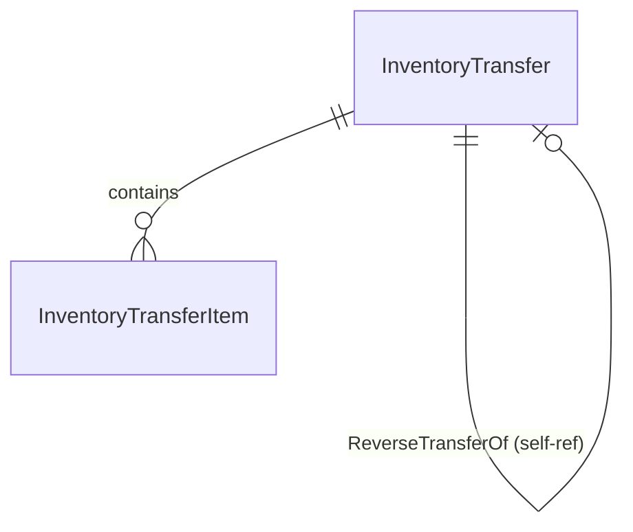

**Header:** `InventoryTransfer`

```sql
-- Header record: the transfer document itself. Columns below are the set relevant
-- to inventory tracking, not the table's full column count.
Id
Number
From.Id                    -- source Location
To.Id                      -- destination Location
Type.Id                    -- FK to TransferType — tenant-configurable + system-generated values, §2.1
ExecutionStatus            -- 0=Pending, 1=Picked, 2=Received, 3=Canceled, 4=Partially Picked
Date
PickedDate
ReceivedDate
Invoice.Id                 -- populated for Transfer-to-Job — the invoice this transfer fulfills
Requisition.Id             -- optional link to the Requisition this transfer fulfills
AutoConsumeAdjustment.Id   -- set when an IsAutoConsumed item is auto-expensed on receipt — see below
ReverseTransferOf.Id       -- self-referential: identifies this transfer as the reversal of another
RolledOverFrom.Id          -- unfulfilled quantity rolled over from a prior Transfer
Source.SourceType / .Id    -- enum InventoryTransferSourceType: 0=None, 1=ServiceAgreementVisit, 2=SoldEstimate,
                          -- 3=QuantityToOrder. Shares label names with ItemRequisitionType (§1.8) but uses
                          -- different numbering — a different enum, not the same one reused
IsConsignment
Active                     -- 0 when Canceled (ExecutionStatus = 3, above)
```

**Line:** `InventoryTransferItem`

```sql
-- Line record: one SKU/quantity on the transfer, tied to InventoryTracking via its own Id.
Id
InventoryTransfer.Id
SkuReference.SkuId         -- the item — see §1.1 for SkuReference vs. Sku.Id
FromBin.Id                 -- source Bin
ToBin.Id                   -- destination Bin
QuantityToTransfer
QuantityPicked
QuantityAvailable
Cost
UnitOfMeasureCost   -- see §7
TotalCost
ItemRequisition.Id         -- mutually exclusive with RequisitionItem.Id below — see §3.6
RequisitionItem.Id         -- mutually exclusive with ItemRequisition.Id above — see §3.6
ReverseTransferItemOf.Id   -- self-referential: identifies this line as the reversal of another
Active
```

**Identifying a transfer's flow type:**

| Condition | Meaning |
|---|---|
| `FromBin.Id = ToBin.Id` and `ReverseTransferOf.Id IS NULL` | Transfer to Job — Service Location |
| `FromBin.Id ≠ ToBin.Id` | Transfer to Job — Truck, or a standard between-location transfer |
| `ReverseTransferOf.Id IS NOT NULL` (header) / `ReverseTransferItemOf.Id IS NOT NULL` (item) | Reverse Transfer |

This is a reliable, repeatedly-validated pattern for identifying actual TTJ instances (see §2.1 for the caveat on the `TransferType.TransferItemsToJobs` flag, which indicates capability, not per-instance behavior).

**The Transfers to Jobs feature gate affects more than UI visibility (§1.2).** It also changes Requisition workflow behavior, and enables **Standalone Transfer to Jobs** — a TTJ transfer created directly, without first going through a Requisition.

**`InventoryTransfer.AutoConsumeAdjustment.Id`** ties to `InventorySku.IsAutoConsumed` (§2.2), not to Transfer-to-Job. When an item flagged `IsAutoConsumed = 1` is transferred (e.g., Warehouse → Truck) and that Transfer is received at the destination, the system automatically generates an Adjustment of **Type 4 (Consumables)** that decreases the quantity right back out at the destination — the item is auto-expensed/consumed on arrival rather than tracked as on-hand inventory. `AutoConsumeAdjustment.Id` links the Transfer to that generated Adjustment.

**"Disable auto-item consumption with TTJ."** By default (feature gate off), a received TTJ transfer's items are auto-consumed onto the invoice automatically; with the feature gate on, that's disabled and items are consumed/added to invoices manually via a closeout screen instead.

**Three tenant settings shape the TTJ workflow further** (`Inventory.Configuration`, §1.5): `AutoAssignTruckToJobTransfers` decides a TTJ's destination — whether created via Requisition fulfillment or standalone from the job invoice screen. When on, and the job has an assigned technician, the transfer goes from the Warehouse to that technician's Truck; when off, it goes to the job's service location instead, regardless of whether a technician is assigned. `PromptJobTransferOnPoReceipt` (boolean) prompts users with the Create Transfer and Receive Purchase Order permissions to create a Transfer to Job immediately after receiving an eligible job-linked PO, connecting the PO-receiving and TTJ-creation steps. `RequireConfirmationBeforeReceivingTransfers` is a checkbox in Settings; when enabled, a confirmation pop-up appears when a user clicks Receive on a transfer.

**Staging Picklists** is a separate feature gate that adds two tools to the Inventory module, both under **Manage**: **Picklists** and **Technician Returns**.

- **Picklists** are generated for a Job or a Project — a simple list of items to gather for a technician.
- **Technician Returns** surfaces items sitting in a technician's truck that either aren't on that truck's replenishment template stock list, or exceed the max quantity set on that template. From here, a user can generate a **Transfer** from the truck to another location (e.g., a warehouse), or generate a **Return to Vendor**.

Not detailed further here — out of scope unless a specific tool touches either workflow.

### 3.5 Adjustments

**Header:** `InventoryAdjustment`

```sql
-- Header record: the adjustment document itself.
Id
Number
Type              -- see the table below — 3 user-selectable values, rest system-generated
Location.Id       -- polymorphic FK: the Warehouse, Truck, or MobileStorage this adjustment applies to
BusinessUnit.Id
Invoice.Id
Project.Id
ReturnedFrom.Id   -- populated when this Adjustment relates to a Return — see §3.8
Date
Active
```

**Line:** `InventoryAdjustmentItem`

```sql
-- Line record: one SKU/quantity on the adjustment.
Id
InventoryAdjustment.Id
SkuReference.SkuId / .SkuType   -- the item — see §1.1 for SkuReference vs. Sku.Id
InvoiceItem.Id
Bin.Id
AdjustmentQuantity
QuantityAvailable
Cost
TotalCost
ConsignmentSource.EntityId / .SourceType
ProcuredFrom.Id                              -- legacy, obsolete field — see below
-- plus the full ProcurementSource pattern (§1.8, Pattern A)
Active
```

`ProcuredFrom.Id` is a deprecated legacy field, obsolete in code (`[Obsolete("Use ProcurementSource instead")]`) — it holds a `PurchaseOrderItem.Id` (the specific PO *line item*, not the PO header), not a discriminated reference like `ProcurementSource`. Historically, it was only ever populated on **Adjustment Type 2** (Inventory Return, generated from the Requisition Closeout screen — above), and only for items that were actually procured through a vendor PO in the first place. The modern replacement is `ProcurementSource.PurchaseOrderItemId`, part of the same Pattern A structure that also covers `RequisitionItemId`, `EstimateItemId`, and `TransferItemId`. Where `ProcuredFrom.Id` is populated today, its value matches `ProcurementSource.PurchaseOrderItemId` exactly — the two are redundant, not conflicting, for the cases where both exist. The same legacy field exists on `InvoiceItem` too (§8.3), serving the same pre-`ProcurementSource` role there — with the difference that `InvoiceItem`'s version could reference broader source types, since Invoice Items can also originate from Estimates, a path Adjustments never have.

**`InventoryAdjustment.Type`:** only three values are user-selectable when manually creating an Adjustment — **Inventory Quantity Adjustment**, **Beginning Balance**, and **Consignment** (when enabled). Every other value is generated exclusively by its corresponding system workflow; a user cannot pick it directly.

| Value | Type | Manual or System | Notes |
|---|---|---|---|
| 0 | Inventory Quantity Adjustment | User-selectable | Default |
| 1 | Beginning Balance | User-selectable | Default |
| 2 | Inventory Return | System-generated | Requires Requisition-Closeout feature gate. **Intended to be hold-release only, with no GL impact** — generated from the Requisition Closeout screen when a fulfilled-but-uninvoiced requisitioned item is returned to warehouse. **Known system gap:** it currently *does* produce a GL impact, contrary to intended design. This has not been fixed and needs review by the Accounting (ACC) and Inventory (INV) product teams before any tool relies on the "no GL impact" assumption. |
| 3 | Inventory Count | System-generated | Default. Generated by a completed Count (§3.7). |
| 4 | Consumables | System-generated | Default. Generated when an `IsAutoConsumed` item is transferred and received (§3.4). |
| 5 | Return to Warehouse | System-generated | Default. Generated by selecting the matching Return type (§2.1, §3.8). |
| 6 | Consignment | User-selectable | Requires Consignment Inventory feature gate |
| 7 | Consignment Inventory Count | System-generated | Requires Consignment Inventory feature gate |
| 8 | Return to Vendor | System-generated | Default. **Auto-generated by the system whenever the linked Invoice Item is Active** — this is the "rebalance" adjustment tied to vendor Returns (see §3.8). |
| 9 | Intracompany Transfer Incoming | System-generated | Requires Inventory Transfers Between Tenants feature gate — used for Enterprise Hub Network tenants. The receiving side of a cross-tenant inventory move: increases quantity at a location on the receiving tenant. Generated by that tenant's own `IntracompanyTransfer` record — see below, not a standalone Adjustment. |
| 10 | Intracompany Transfer Outgoing | System-generated | Requires Inventory Transfers Between Tenants feature gate. The sending side: decreases quantity at a location on the sending tenant. Generated by that tenant's own `IntracompanyTransfer` record — see below. |

**Cross-tenant transfers (Enterprise Hub Network)** are modeled through a dedicated Transfer-like table pair, `IntracompanyTransfer` (header) and `IntracompanyTransferItem` (line), one instance on each tenant's side. Each side's `IntracompanyTransfer.Adjustment.Id` links to that tenant's own Type 9 or Type 10 Adjustment, which is what actually moves the tracking ledger — the `IntracompanyTransfer` record is the transfer-level document; the Adjustment is what touches `InventoryTracking`.

**`IntracompanyTransfer`**

```sql
-- Header record: this tenant's side of a cross-tenant transfer. The counterpart tenant has its own
-- separate IntracompanyTransfer row, correlated via the GUID fields below.
Id
Number
ReferenceNumber
Memo
Status
Type.Id                    -- FK to IntracompanyTransferType — closed, only 2 values, see below
Adjustment.Id              -- links to this tenant's own Type 9/10 Adjustment — the actual InventoryTracking touchpoint
TenantLocation.Id          -- the counterpart tenant's location
Tenant.TenantGroupId / .Name / .Id
Location.Id                -- this tenant's own location
ShippedBy.Id
ReceivedBy.Id
PickedBy.Id
CanceledBy.Id
CanceledReason             -- shares the CanceledReason enum, §1.7
DateShipped
DatePicked
DateReceived
DateRequired
Date
RolledOverFrom.Id          -- unfulfilled-quantity rollover lineage, same pattern as InventoryTransfer
IsConsignment
IntracompanyTransferId      -- uniqueidentifier: correlates this transfer across two separate tenant databases
RequestTransferId           -- uniqueidentifier
Active                      -- 0 when canceled, see CanceledReason above
```

**`IntracompanyTransferItem`**

```sql
-- Line record: one SKU/quantity on this tenant's side of the cross-tenant transfer.
Id
IntracompanyTransfer.Id
RequisitionItem.Id          -- populated if this cross-tenant move fulfills a Requisition
TenantBin.Id                -- the counterpart tenant's bin
Bin.Id                      -- this tenant's own bin
InvoiceItem.Id               -- populated if this item is tied to an invoice
Cost
UnitOfMeasureCost   -- see §7
TotalCost
QuantityToTransfer
QuantityPicked
SkuReference.SkuId / .SkuType
IntracompanyTransferItemId   -- uniqueidentifier: same cross-database correlation purpose as above
Active
```

**`IntracompanyTransferType`** is fully closed, not tenant-extensible: `0 = Outgoing`, `1 = Incoming` — only these two values exist, unlike `TransferType`/`PurchaseOrderType`.

### 3.6 Requisitions

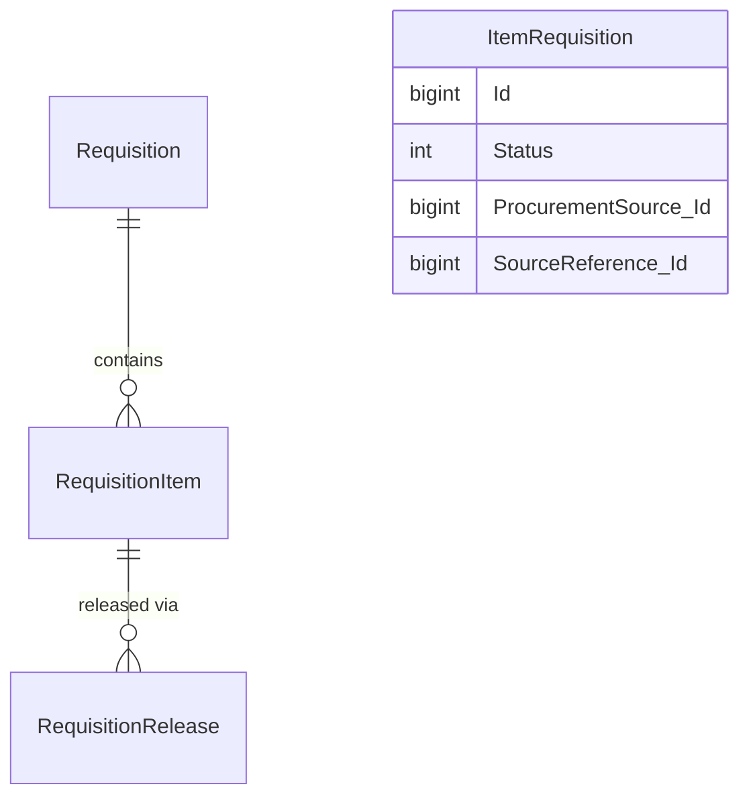

Note that `ItemRequisition` has **no parent `Requisition` entity** — it lives entirely independently, despite conceptually resembling a line item.

**`Requisition`**

```sql
-- Header record: the requisition itself, covering both Install and Service/Mobile flows.
Id
Number
Name
Status              -- see below
Type                -- see below
OwnerReference.Type / .Id
Estimate.Id          -- always matches OwnerReference.Id for Estimate-based requisitions; see below
InventoryLocation.Id
BusinessUnit.Id
Transfer.Id          -- legacy, essentially unused — only 2 records across all tenants; Service/Mobile Requisitions only
TransferTo.Id        -- Service/Mobile Requisitions only, actively used: the initiating technician's Truck.Id
Active               -- 0 when Cancelled (Status = 3, below)
```

**`Requisition.Status`:** -1=In Demand, 0=In Fulfillment, 1=Procured, 2=Completed, 3=Cancelled.
**`Requisition.Type`:** 0=Install Requisition, 1=Service/Mobile Requisition. Install Requisition's closeout workflow requires the Requisition-Closeout feature gate (§1.10); Service/Mobile Requisition itself requires the "Enable Requisition Workflow for Service Job" feature gate.

**A different enum governs `BusinessUnitRequisitionMapping`** (`Inventory.Configuration`, §1.5), which assigns each Business Unit a default requisition-creation mechanism. **Only two options are actually selectable — Install Requisition or Item Requisition. Service/Mobile Requisition is not an option here at all**, despite `Requisition.Type` itself supporting that value elsewhere (above). This is not the same enum as `Requisition.Type` — `Requisition.Type` covers Install and Service/Mobile only (`Requisition` has no third state of its own), while `BusinessUnitRequisitionMapping`'s two real options are Install and the wholly separate `ItemRequisition` entity (below). Same naming pattern, genuinely different value sets — treat them independently.

**`MaintainEstimateCostThroughRequisition`** (§1.5): when enabled, item costs from the originating Estimate auto-populate onto Install Requisitions and every subsequent transaction created from that Requisition — but remain editable on the resulting Purchase Order and Receipt. This is the mechanism behind cost values flowing from an Estimate through to `RequisitionItem`, `PurchaseOrderItem`, and `InventoryShipmentItem`'s `Cost` fields (§3.1, §3.2).

**`OwnerReference.Type`** is an independent axis from `Requisition.Type` — it describes the origination context, and which values are valid depends on the Requisition's Type:

| Value | Origination Context | `OwnerReference.Id` refers to | Valid for |
|---|---|---|---|
| 0 | Estimate-based — created from a sold estimate | Estimate ID | Both Install and Service/Mobile Requisitions |
| 1 | Project-standalone — no estimate, created directly on the project | Project ID | Install Requisitions only |
| 2 | Job-standalone — no estimate, or based on a mobile estimate created by a tech; created on the service job from mobile | Job ID | Service/Mobile Requisitions only |

`OwnerReference` is set once at creation and **does not migrate** over the Requisition's lifecycle. `Requisition.Estimate.Id` always matches `OwnerReference.Id` for Estimate-based requisitions — it carries no independent value beyond what `OwnerReference` already provides.

**`RequisitionItem`**

```sql
-- Line record: one SKU/quantity requested. The four *Item.Id columns below are this table's
-- instance of the discrete-named-FK pattern (§1.8, Pattern B) — no discriminator column.
Id
Requisition.Id
Status
SkuReference.SkuId
QuantityRequested
Job.Id                -- direct Job link at the item level
EstimateItem.Id        -- Pattern B fulfillment FK
PurchaseOrderItem.Id   -- Pattern B fulfillment FK
TransferItem.Id        -- Pattern B fulfillment FK
InvoiceItem.Id         -- Pattern B fulfillment FK
SplitParent.Id       -- requisition items can be split; tracks lineage back to the original
ProcurementBin.Id
ProcurementVendor.Id
Active               -- 0 when Cancelled (Status = 3, below)
```

**`RequisitionItem.Status`:** -1=Not Started, 0=In Progress, 1=Fulfilled, 2=Completed, 3=Cancelled, 4=Not Required, 5=Deleted.

**`RequisitionRelease`**

```sql
-- Release record: quantity released from hold to a specific bin, generating its own tracking row — see §1.1.
Id
RequisitionItem.Id
ReleasedTo.Id
QuantityReleased
ReleaseToBin.Id
Active
```

**`ItemRequisition`** — fully independent entity, not a `RequisitionItem` variant; gated by its own "Item Requisitions" feature gate (a tenant without it won't have this entity populated at all)

```sql
-- Fully standalone requisition entity — no parent Requisition record exists for this table.
Id
Status                        -- shares RequisitionItem's status enum
BusinessUnitId
InventoryLocation.Id
InstalledEquipmentId          -- ties to the Warranty Parts Tracking feature gate
CostToUse                     -- driven by a tenant-level costing setting (Estimate Item cost, WAC, or
                              -- Primary Cost); may or may not match Cost/TotalCost elsewhere
QuantityRequested
SkuReference.SkuId
ProcurementSource.Type / .Name / .Id   -- .Type is ProcurementSourceType: 0=Vendor, 1=Truck, 2=Warehouse, 3=MobileStorage — see §1.8
SourceReference.Type / .Id
Active                        -- 0 when Cancelled (Status, shares RequisitionItem's enum — see above)
```

`ItemRequisition` and `RequisitionItem` are mutually exclusive on a given `PurchaseOrderItem`/`InventoryTransferItem` — a line's requisition link is one or the other, never both. `ItemRequisition` is not limited to any particular job type; it can be used for any job. The distinguishing factor is purely structural (no parent `Requisition`), and it occupies a different place in the Inventory module's UI, though it can also originate from an Estimate Item the same way a standard Requisition can.

**`ProximityBasedFulfillmentEnabled`** (`Inventory.Configuration`, §1.5) governs smart warehouse selection specifically for Requisitions created from Estimates — it doesn't apply to Requisitions broadly. When enabled (the default for tenants with it available), instead of a user manually picking a fulfillment location, the system resolves each line item's `ProcurementSource` (§1.8) automatically:

1. **Closest Warehouse with full coverage** — by ZIP code proximity to the job location. All-or-nothing per warehouse: a warehouse with partial stock doesn't get used for the partial amount, it's skipped entirely.
2. **Next-closest Warehouse** — same all-or-nothing check, repeated outward.
3. **Fallback to the item's primary Vendor** — if no single warehouse can fully cover the line.

This resolves directly to `ProcurementSourceType` values from §1.8: `2` (Warehouse) when a location is selected, `0` (Vendor) on fallback. Edge cases: no job location/ZIP on the Estimate skips straight to Vendor fallback; a warehouse with an unresolvable ZIP sorts last in proximity order rather than erroring; multiple warehouses at the same ZIP tie-break by warehouse `Id`; and a tenant with no active warehouses at all throws an error rather than silently falling back. This feature also requires a separate feature flag, `EnableProjectRequisitionsV2`, alongside the `ProximityBasedFulfillmentEnabled` config toggle — both must be on.

### 3.7 Counts

**Header:** `InventoryCount`

```sql
-- Header record: the count session itself.
Id
Number
Status                  -- see below
Type                    -- see below
Location.Id             -- polymorphic FK: the Warehouse, Truck, or MobileStorage being counted
AdjustmentCreated.Id     -- links to the resulting Adjustment (Type 3, Inventory Count)
UseQuantityAvailableToPick   -- tenant's TTJ-mode comparison flag — determines which quantity is
                             -- reconciled against below (QuantityOnHand vs. Quantity Available to Pick)
CreatedBySchedule.Id
ReviewedBy.Id
DateStarted
DateCompleted
DueDate
Active                  -- 0 when Canceled (Status = 4, above)
```

**Line:** `InventoryCountItem`

```sql
-- Line record: one SKU/Bin's expected vs. counted quantity.
Id
InventoryCount.Id
Bin.Id
SkuReference.SkuId
QuantityCounted
QuantityOnHand
Order                    -- sequencing of this line within the count session
AdjustmentItem.Id        -- direct link to the resulting InventoryAdjustmentItem
RecountFrom.Id           -- recount lineage
IsConsignment
Active
```

**`InventoryCount.Status`:** 0=Pending, 1=In Progress, 2=Review, 3=Completed, 4=Canceled.
**`InventoryCount.Type`:** 0=Cycle Count, 1=Item Count, 2=Full Inventory Count, 3=Recount, 4=Beginning Inventory Count.

**Adjustment generation is conditional, and the comparison quantity depends on tenant configuration:**

- **Transfers to Jobs not enabled:** an Adjustment is generated when `QuantityCounted ≠ QuantityOnHand`, where `QuantityOnHand = QuantityAvailable + QuantityOnHold`.
- **Transfers to Jobs enabled:** an Adjustment is generated when `QuantityCounted ≠ "Quantity Available to Pick"`, where that value equals `QuantityOnHold` specifically (the Reserved sub-state — see §1.2). The Reserved/Staged/On Site breakdown always exists structurally (§1.2); Transfers to Jobs determines which of these a Count reconciles against, not whether the breakdown exists.

`InventoryCountItem.AdjustmentItem.Id` links each count line directly to its resulting `InventoryAdjustmentItem` (Adjustment Type 3, "Inventory Count").

### 3.8 Returns

**Header:** `InventoryReturn`

```sql
-- Header record: the return document itself.
Id
Number
Vendor.Id
Type.Id                 -- FK to InventoryReturnType — tenant-configurable + system-generated values, §2.1
Status                  -- see below
SendStatus              -- 0=NotSent, 1=InProgress, 2=Sent, 3=Failed — a simpler, different value set than
                        -- PurchaseOrder.SendStatus (§3.1), despite the shared column name
PurchaseOrder.Id
Job.Id
Project.Id
DateCreated
DateReturned
DateCreditReceived
Amount
SalesTax
RestockingFee
PaymentStatus            -- shares the same enum as InventoryBill.PaymentStatus (§3.3): 0=Unpaid, 1=Ready for
                         -- Approval, 2=Initiated, 3=Paid, 4=Cancelled, 5=In Transit, 6=Processing, 7=Rejected
ReferenceNumber
Memo
CanceledReason           -- shares the CanceledReason enum, §1.7
Active                   -- 0 when Cancelled (Status = 3, below)
```

**Line:** `InventoryReturnItem`

```sql
-- Line record: one SKU/quantity being returned.
Id
InventoryReturn.Id
SkuReference.SkuId
QuantityToReturn
Bin.Id
Location.Id                  -- polymorphic FK: the Warehouse, Truck, or MobileStorage this return item belongs to
InventoryAdjustmentItem.Id   -- direct link to the rebalance adjustment
InvoiceItem.Id               -- the Invoice Item being returned — its Active status is the actual
                             -- trigger for whether a rebalance adjustment is expected, see below
Active                       -- this line's own Active — separate from the linked InvoiceItem.Id's Active above
```

**`InventoryReturn.Status`:** 0=Pending, 1=Returned, 2=Credit Received, 3=Cancelled.

**Returns carries direct financial/GL impact** (see §1.9), which is the basis for its inclusion as a full transaction type alongside Purchase Orders, Bills, Adjustments, and Transfers.

**The rebalance adjustment mechanism.** When a Return item is returned to a vendor, the system automatically generates a rebalance **Adjustment Type 8 (Return to Vendor)** — but only while the linked Invoice Item is Active. To determine whether a rebalance adjustment is expected for a given Return Item, check whether its linked Invoice Item (via `InventoryReturnItem.InvoiceItem.Id`) is still Active — that's the actual generation trigger, not something to infer from a possibly-stale direct FK. **This specific flow uses the system-generated `InventoryReturnType = Requisition`** (§2.1) when the Return to Vendor originates from the Requisition Closeout screen. A parallel, name-matched case exists for the other direction: selecting the **Return to Warehouse** return type generates an Adjustment of the matching Type 5 (§2.1, §3.5).

**Cancellation cascade** (inventory-tracking-relevant portion):

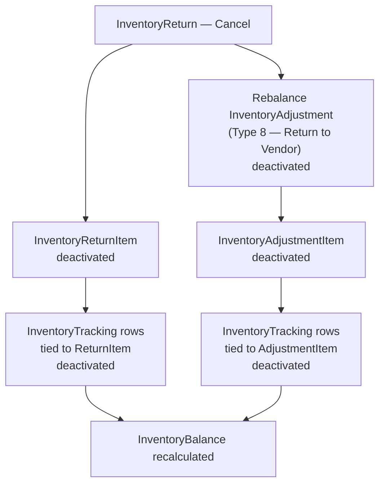

`SyncStatus`, `PurchaseOrder`, and `InvoiceItem` itself are explicitly not touched by this cascade. (The vendor-payables side of this cascade — `VendorCredit` cancellation and `VendorStatement` recalculation — is out of scope here; see Appendix A.)

---

## 4. Cross-Transaction Relationship Map

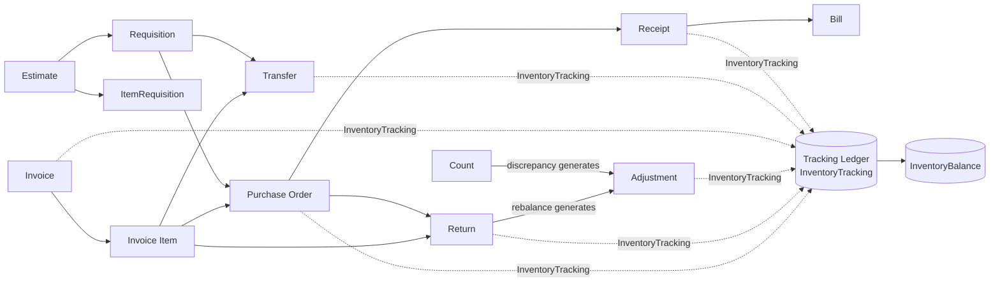

---

## 5. Serialization

### 5.1 Overview and Gating

Serialization is gated at two levels, both of which must be true:

- **Tenant-level:** `IsSerializedTrackingEnabled` in the `Inventory.Configuration` JSON blob (§1.5) — the global switch.
- **Item-level:** `IsSerialized` — recorded on both `Material`/`Equipment` and `InventorySku` (§2.2), the same dual-table pattern `IsInventory` follows — **only possible for items that are already `IsInventory = true`.** A non-inventory item cannot be serialized. **Also mutually exclusive with Unit of Measure** — a serialized item cannot use UoM at all; see §7.1.

**Unlike `IsInventory`, item-level serialization can be reversed.** A "Deactivate Serial Number Tracking" button exists under Pricebook → Material/Equipment → Inventory → Serialization, letting a tenant turn serialization back off for that specific item — there is no equivalent un-inventorying path for `IsInventory` (§2.2).

**The same item-level date-gating principle from §1.5 applies here too, against `SerializedOn` instead of `InventoryEnabledOn`.** If a transaction's relevant date (§1.5 — e.g., an Invoice Item's On Hold date, a PO's `Date`) falls before the item's `SerializedOn`, that transaction line does not require or carry serial number tracking, even though the item is currently, correctly marked serialized.

Once an item is serialized, the system enforces serial number selection at nearly every quantity-moving touchpoint — a pending Transfer requires a serial number to be picked, an Invoice requires one to be assigned before the job can be completed, and so on. The goal is to guarantee every unit of quantity has a corresponding serial number, with one exception (§5.4).

### 5.2 Serial Number Status

`InventorySerialNumber.Status` closely parallels the bucket-movement `Type` codes on `InventoryTracking` (§1.2) — each status corresponds to roughly the same triggering event:

| Value | Status | Parallels `InventoryTracking.Type` (§1.2) |
|---|---|---|
| 0 | Available | Receipt / Transfer Received at destination (Type 2); Adjustment created — increase direction (Type 0, includes Return to Warehouse adjustments, §3.5) |
| 1 | On Hold | Transfer Created (Type 3) |
| 2 | Consumed | Invoice Completed (Type 9) |
| 3 | Returned | Return marked Returned (Type 4) |
| 4 | Removed | Adjustment created — decrease direction (Type 0) |
| 5 | Staged | Transfer Picked (Type 6) |
| 6 | On Site | Added to Invoice / Hold on Invoice (Type 8) |

This is a real parallel, not a shared enum — the two are separate columns on separate tables with independent value sets that happen to track the same underlying movements. Note that `Type 0` is bidirectional (`± Available`, §1.2) and covers both **Available** and **Removed** above, depending on whether the Adjustment increases or decreases quantity — the same underlying tracking type, opposite directions.

**Available also has paths that aren't `Type` parallels at all.** Recall from §5.3 that a serial number's `Transaction.Id` tracks whichever transaction currently holds it, and is `NULL` only while Available. If that transaction item is later deactivated — this isn't Invoice-specific; it applies to any transaction the serial number was selected on, including a Transfer or a Return — `Transaction.Id` clears and the serial number reverts to **Available at the bin it occupied before that transaction moved it** (its origin bin for that transaction). This is the cascading-deactivation mechanism from §5.3 in practice, not a new triggering event of its own. Separately, a serial number can reach Available without any incoming transaction at all — see §5.3 for the manually-added case, and for what happens if the incoming transaction itself gets cancelled.

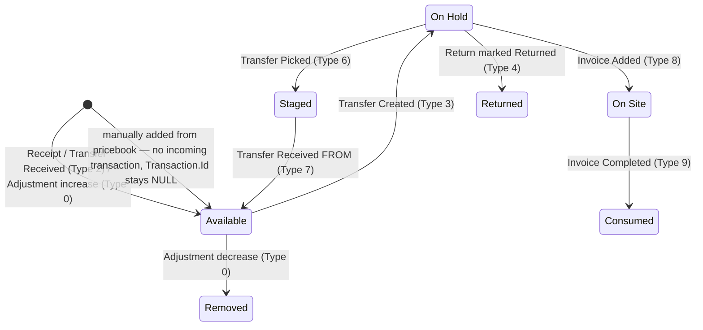

This shows the primary forward flow only. It leaves out two exception paths, covered in prose above and below instead, since both carry conditions that don't compress cleanly into an edge label: **removal from any transaction reverts a serial number to Available at its origin bin** (not shown from every state here, to keep the diagram readable), and **cancelling the incoming transaction deactivates the serial number outright — but only while it's still Available**, since the system blocks that cancellation once the serial number has moved on.

### 5.3 Core Tables

The same two-tier pattern from §1.1 repeats here: `InventorySerialNumber` is the *current-state* record — one row per physical serial number, updated in place as it moves — while `SerializedTrackingLog` is the *ledger*, one row per movement event.

**`InventorySerialNumber`**

```sql
-- Current-state record: one row per physical serial number.
Id
SerialNumber
Sku.Id                   -- legacy — prefer SkuReference.SkuId/.SkuType below, see §1.1
SkuReference.SkuType / .SkuId   -- the item
Type                     -- 0=Owned/Single, 1=Consignment — parallels Disposition (§1.6) conceptually, but is a
                         -- separate enum with its own numbering; Disposition's Consignment is 2, not 1
Status                   -- see table above
Bin.Id                   -- current location — updates as the serial number moves with its item via Transfers
Date                     -- the date of the transaction that produced this row's current state (can be backdated,
                         -- e.g. an Adjustment dated 5 days ago produces this same backdated Date); exception: when
                         -- retroactively adding a missing serial number from the pricebook for an already-serialized
                         -- item, Date matches the actual CreatedOn of that addition instead
Transaction.Id           -- the CURRENT transaction only, not a final/terminal value — see below
IsEditable               -- governed by active transaction count and export status, not by Status directly — see below
Active                   -- see below — two distinct paths to 0: cascading deactivation from a subsequent
                         -- transaction's removal, or the incoming-transaction-cancellation rule
```

**`IsEditable` — the rule, from source.** `IsEditable = true` when a serial number has **0 or 1 active transactions** and its incoming transaction (if any) has **not** been exported to an accounting platform; `IsEditable = false` once either condition fails — **2 or more active transactions**, or an exported incoming transaction. A newly-created serial number starts `true`. "Incoming transaction" here means a Receipt item (from a non-consignment PO) or an Adjustment item (non-consignment, non-invoice-related) — the transaction that originally brought the serial number into the system. In the UI, an input field is disabled whenever `!IsEditable OR !Active` (or a UI-level `disabled` prop) — so an inactive serial number is always non-editable regardless of `IsEditable`'s own value.

**This is meaningfully different from what this document previously guessed** — `IsEditable` is not simply "Available = editable." A Returned or Removed serial number with zero active transactions is still editable; a serial number with two active transactions is not editable regardless of its `Status`.

> **Note — stated as an observation, not confirmed design intent:** as with the placeholder "N/A" serial numbers in §5.5, the "exported incoming transaction" half of this rule was built for a scenario — an accounting platform receiving synced serial number data — that doesn't currently exist in production. No accounting platform ServiceTitan integrates with today actually syncs serial numbers. In practice, this means the export-based lockout never fires, and `IsEditable` today is effectively governed only by the active-transaction-count condition. This is a personal observation flagged for awareness, not a confirmed engineering position.

**`SerializedTrackingLog`**

```sql
-- Ledger record: one row per movement event for a given serial number.
Id
SerialNumber.Id          -- FK to InventorySerialNumber
Transaction.Id           -- the transaction item that caused this movement (Receipt, Adjustment, Transfer, Invoice, Return, ...)
CreatedOn
CreatedBy.Id
Active                   -- deactivates when its linked transaction item deactivates, see below
```

**`InventorySerialNumber.Transaction.Id` tracks the current transaction, not a final/terminal one.** It's `NULL` while the serial number is Available, and populated for every other status — On Hold, Staged, On Site, or Consumed. As the serial number moves between these states, `Transaction.Id` gets reassigned to whichever transaction currently holds it; it's cleared back to `NULL` if the serial number reverts to Available. From source, this is a genuinely separate field from the ledger below: `Transaction` (singular, nullable) holds the current holder, while a separate `Transactions` collection — backed by `SerializedTrackingLog` — accumulates the complete history. Two service methods manage the singular field directly: `AssignTransactionToSerialNumberAsync()` sets it, `UnassignTransactionFromSerialNumberAsync()` clears it.

**Cascading deactivation.** If the transaction item a serial number was selected on later gets deactivated (`Active = 0`) — a Transfer, Return, or Invoice item removed, and so on — the corresponding `SerializedTrackingLog` row deactivates along with it, `Transaction.Id` clears back to `NULL` (via `UnassignTransactionFromSerialNumberAsync()`, above), and the serial number reverts to Available at its origin bin for that transaction (§5.2).

**A different rule governs the *incoming* transaction — the one that originally brought the serial number to Available.** Since `Transaction.Id` is already `NULL` at that point (Available, above), finding the incoming transaction means looking at `SerializedTrackingLog` history, not the singular `Transaction.Id` field. Cancelling or deleting that incoming transaction doesn't revert the serial number to some prior state — there is no prior state, since that transaction *was* its origin. Instead, the serial number itself gets deactivated: `Active = 0`.

**This incoming-transaction cancellation is blocked once the serial number has moved on.** If the serial number is no longer sitting in Available — it's been used on any subsequent transaction, whether that transaction is completed or not — the system will not allow the original incoming transaction to be cancelled or deleted. The block applies purely because a later transaction now depends on that serial number; it has nothing to do with the incoming transaction's own status.

**A serial number can also reach Available with no incoming transaction at all.** Manually adding a serial number from the pricebook (§5.1's "add missing serial numbers" scenario) creates an `InventorySerialNumber` row directly, with no `SerializedTrackingLog` row behind it and a `NULL` `Transaction.Id` — there was never an incoming transaction to record. The incoming-transaction-cancellation rule above simply doesn't apply to these; there's nothing to cancel.

### 5.4 The Requisition Exception

Every other quantity-reserving transaction type requires serial number selection at the point of reservation. **Requisitions are the one exception:** a `RequisitionItem` reserves *quantity* on hold, but does not reserve a *serial number* at that point. The serial number gets selected later — at closeout, for non-Transfer Requisitions, or at the Transfer-to-Job step for TTJ-fulfilled ones.

This matters for any tool reconciling quantity against serial number counts: available serial numbers must be considered net of Requisition-reserved quantity, since that reserved quantity has no serial number of its own reserved against it yet.

### 5.5 Placeholder ("N/A") Serial Numbers

When an item is marked serialized while it already has quantity sitting in **non-exported transactions** (transactions not yet locked by export to an accounting platform like QuickBooks or Intacct — the accounting-side mechanics are out of this document's scope) or in **reserved/staged/on-site quantities** (or On Hold, for tenants without Transfers to Jobs), the system auto-generates placeholder serial numbers with an "N/A" number, one per unit of that existing quantity. These placeholders can later be replaced with real serial numbers added from the pricebook.

**Purpose:** to guarantee no unit ever exports to an accounting platform with a null serial number, on either the ServiceTitan or the accounting-platform side.

> **Note — stated as an observation, not confirmed design intent:** the person documenting this has pointed out that no accounting platform ServiceTitan currently integrates with actually receives serial number exports, meaning the scenario this mechanism was built to prevent doesn't currently occur in practice — and that, from a data-integrity standpoint, these placeholder records could arguably be removed entirely today. This is a personal observation flagged for awareness, not a confirmed engineering position or a decision this document is making.

---

## 6. Replenishment

### 6.1 Overview and Location Assignment

Replenishment is driven by **Templates** assigned to Locations, not by a per-transaction setting. The FK lives on the *location* side: `Warehouse`, `Truck`, and `MobileStorage` (§2.1) each carry their own `Template.Id`. The relationship is many-to-one — several locations can share the same Template.

**`InventoryTemplate.Type`:** 0=Truck, 1=Warehouse, 2=MobileStorage — identifies which location type the template is meant for.

**The trigger condition:** for a given Bin, when `QuantityAvailable + QuantityOnOrder` (§1.1) falls below the `MinQuantity` set on that item's `InventoryTemplateItem` row, a `ReplenishmentRequest` is generated.

### 6.2 Core Tables: Templates

**`InventoryTemplate`**

```sql
-- Header record: one Template, assignable to multiple locations (§2.1).
Id
Type                          -- 0=Truck, 1=Warehouse, 2=MobileStorage
Name
Active                        -- deactivating a Template cascades Active=0 to its InventoryTemplateItem rows, see below
IsConsignment                 -- see the asymmetric rule below
BinsLocationCode.BinLocationCodeId   -- Enhanced Bin Tracking only (§2.1) — 0 when that feature is not enabled
BinsLocationCode.Data                -- Enhanced Bin Tracking only — NULL when that feature is not enabled; not detailed
                                     -- further here, consistent with §2.1's treatment of that closed-beta feature
```

**`InventoryTemplateItem`**

```sql
-- Line record: one SKU's min/max thresholds on this Template.
Id
Template.Id
SkuReference.SkuId / .SkuType   -- the item — see §1.1 for SkuReference vs. Sku.Id
MinQuantity                    -- the trigger threshold — see §6.1
MaxQuantity                    -- the replenishment ceiling — see §6.4 for how this interacts with negative balances
Memo
UnitOfMeasure.Id   -- see §7
Active                         -- 0 when deactivated individually, or cascaded from the parent Template above
IsConsignment                  -- see the asymmetric rule below
```

**`IsConsignment` is an asymmetric constraint, not a strict match requirement.** A Template marked `IsConsignment = true` may contain a mix of consignment and non-consignment items. A Template marked `IsConsignment = false` cannot contain any item where `IsConsignment = true` — the false case is a hard ceiling, the true case is permissive.

### 6.3 Replenishment Requests

**`ReplenishmentRequest`**

```sql
-- One request per SKU/Bin shortage. Bin.Id/InventoryLocation.Id are the shortage side; ReplenishmentSource
-- is the supplying side — these are two different sides of the same request, not duplicate location fields.
Id
Bin.Id                        -- where the shortage is
InventoryLocation.Id          -- where the shortage is
SkuReference.SkuId / .SkuType   -- the item
Sku.Id                        -- legacy — prefer SkuReference above, see §1.1
Status                        -- 0=Pending, 1=InProgress, 2=Completed, 3=Cancelled — see below for the full lifecycle
Active                        -- 1 for Status 0-1, 0 for Status 2-3 — moves in lockstep with Status, see below
ModifiedOn                    -- drives archival eligibility once Active = 0 — see below
Quantity
Cost
UnitOfMeasure.Id   -- see §7
IsConsignment
ReplenishmentSource.Type      -- 1=Location (internal transfer), 2=Vendor (external purchase, default/most common)
ReplenishmentSource.Id        -- FK target depends on .Type: InventoryLocation.Id for Type 1, Vendor.Id/SkuVendor.Id for Type 2
SkuVendor.Id                  -- FK to MaterialVendor.Id or EquipmentVendor.Id — see below
Vendor.Id                     -- the resolved vendor for this request
```

**`ReplenishmentRequest.Status` — the full lifecycle:**

| Value | Status | Set when |
|---|---|---|
| 0 | Pending | Default state — created when a Bin's quantity falls below the template's Min, or reset back here from an expired InProgress lock (see below) |
| 1 | InProgress | A user initiates converting the request into a Transfer or a Purchase Order — a temporary lock preventing double-processing. A background job auto-reverts stale locks back to Pending if InProgress for more than an hour, covering failed or abandoned conversions |
| 2 | Completed | The request is fulfilled (a PO or Transfer is successfully created from it), **or** the shortage resolves on its own — quantity reaches the template's Max without any transaction being generated from this request. Also the value used for pre-`Status`-field legacy requests migrated in bulk |
| 3 | Cancelled | The request is invalidated by a configuration change — the template is deactivated, the SKU is removed from the template, or the location is unassigned from the template — rather than fulfilled or naturally resolved |

**`Active` moves in lockstep with `Status`, cleanly:** `Active = 1` for `Status 0` (Pending) and `Status 1` (InProgress); `Active = 0` for `Status 2` (Completed) and `Status 3` (Cancelled). Both terminal states — fulfilled and invalidated — deactivate the row the same way; **`Completed` vs. `Cancelled` is the meaningful distinction for a tool to check, not `Active` alone.** A request found `Active = 0` could mean it was successfully fulfilled, naturally resolved without any transaction, or invalidated by a template/SKU/location change — three different outcomes that `Active` alone can't distinguish.

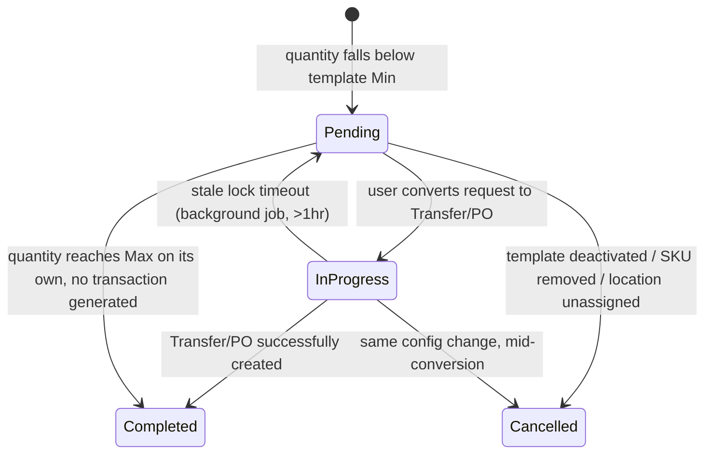

**`ReplenishmentSource`** determines what the request will generate once fulfilled: **Type 1 (Location)** generates an **Inventory Transfer** or an internal requisition request, sourced from the supplying location (`ReplenishmentSource.Id` → `InventoryLocation.Id`); **Type 2 (Vendor)** — the default and most common case — generates line items on a **Purchase Order**, via the Replenishment Wizard. Both the resulting PO and Transfer carry the system-generated "Replenishment" `Type` value documented in §2.1; for POs specifically, which `GroupingOption` value range applies depends on the Purchasing Module feature gate, per §3.1.

**Vendor resolution: `SkuVendor.Id` is not the same field as `Vendor.Id`.** A replenishment request defaults to the item's `Material`/`Equipment`.`PrimaryVendor.Id` (§2.2). That default is recorded as `SkuVendor.Id` — a FK to the `Id` column on **`MaterialVendor`** or **`EquipmentVendor`** (a per-item-per-vendor junction record, not the vendor itself), while `Vendor.Id` is the resolved vendor FK read off that junction record. Users can then override the source to a different vendor, or switch `ReplenishmentSource.Type` to a Location entirely.

```sql
-- MaterialVendor: one row per Material-vendor relationship.
Id
Material.Id
Vendor.Id
IsPrimary                     -- true = this is the item's PrimaryVendor.Id default
PartNumber
Cost
Memo
Active
PrimarySubaccount.Id          -- GL subaccount mapping — accounting-side concept, out of scope here
```

```sql
-- EquipmentVendor: same shape as MaterialVendor, for Equipment items.
Id
Equipment.Id
Vendor.Id
IsPrimary
PartNumber
Cost
Memo
Active
PrimarySubaccount.Id
```

`SkuVendor.Id` has no discriminator column of its own — which table it resolves against, `MaterialVendor` or `EquipmentVendor`, is determined by `ReplenishmentRequest.SkuReference.SkuType` (1=Material, 2=Equipment), the same discriminator pattern used everywhere else in this document (§1.1).

**`ReplenishmentRequestArchive`** shares nearly the same shape as `ReplenishmentRequest` (missing only the legacy `Sku.Id` column, consistent with `Sku.Id` being phased out — §1.1) — both inherit from a shared base class covering the fields they hold in common.

**The archival process is a genuine hard delete — a second, distinct exception to §1.4's soft-delete pattern**, alongside the full tenant inventory wipe already noted there. A background job runs every 15 minutes, but only actually processes each tenant once per day. It finds requests where `Active = 0` and `ModifiedOn` is more than **30 days** in the past, processes them in batches of 250, and for each one: copies the full row into `ReplenishmentRequestArchive`, then **deletes it from the live `ReplenishmentRequest` table** — not a soft deactivation, an actual row removal. The job caps itself at 2 hours of runtime per execution. Once archived, a row stays in the Archive table indefinitely; there's no further cleanup process on that side. All four `Status` values are preserved as-is in the archived copy.

**Practical implication for tooling:** a `ReplenishmentRequest` row disappearing entirely (not just going `Active = 0`) is expected behavior once it's 30+ days past its last `ModifiedOn` — that's not data loss or corruption, it's the archival job doing its job. A tool needing the full history of a request older than ~30 days needs to check `ReplenishmentRequestArchive`, not assume the live table holds everything.

### 6.4 The "Only Replenish Max" Setting

A tenant-level setting, `OnlyReplenishMax` (`Inventory.Configuration`, §1.5), controls what happens when the current inventory balance is negative:

- **Enabled:** replenishment orders only up to the `MaxQuantity` on the template, even if the balance is negative.
- **Disabled:** replenishment can order *past* `MaxQuantity` if the balance is negative, to actually cover the deficit.

A related setting, `RoundUpReplenishmentToWholeUom`, rounds the calculated replenishment quantity up to a whole Unit of Measure rather than allowing fractional amounts — examples from the UI: units in a case round up to the nearest full case pack, units in a pallet round up to the nearest full pallet. See §7 for Unit of Measure tracking in full.

### 6.5 Date-Based Triggering — Not "Pre-Replenishment"

**Replenishment evaluates current quantities only — it does not look ahead at future-dated transactions.** A future-dated Invoice Item holding On Site quantity (§1.2) doesn't trigger replenishment early just because it will eventually push `Available + On Order` below `MinQuantity`. The request only generates once that transaction's date actually arrives and the shortage is real, as of today. This is a meaningful distinction for any tool reasoning about *when* a replenishment request should exist: the check is always against present-day actual quantities, never a projected future state.

---

## 7. Unit of Measure

### 7.1 Overview and Gating

Two gating levels:

- **Tenant-level:** `EnableUnitOfMeasure` (§1.5) — hardcoded, no FG dependency today; a prior gating FG was sunset.
- **Item-level:** `InventorySku.HasUnitOfMeasure` (§2.2), alongside the paired `UnitOfMeasureEnabledOn`/`DateUnitOfMeasureEnabled` timestamps already documented there.

**Serialized items cannot use Unit of Measure at all.** The two features are mutually exclusive per item — per ServiceTitan's own product documentation, serialized equipment is "individually tracked" in a way that's incompatible with unit conversion. See §5.1 for the serialization side of this exclusion.

Unit of Measure applies to both inventory-tracked and non-inventory items. The two behave more similarly than the difference in tracking might suggest — see §7.3 for how the base-unit conversion mechanism handles each.

### 7.2 Core Tables

**`UnitOfMeasure`**

```sql
-- One row per unit definition for a given item — both the base unit and each alternate/purchasing unit
-- get their own row here; UnitOfMeasureBase.Id links an alternate unit back to its base.
Id
SkuReference.SkuType / .SkuId   -- the item this unit applies to — see §1.1 for SkuReference vs. Sku.Id
Name
SkuCode                   -- the short unit code (e.g., "Roll", "Jug", "EA") — matches the UI's unit-name field
UnitOfMeasureBase.Id       -- NULL on the base unit's own row; populated on alternate units, pointing back to the base row
Quantity                   -- 1 always on the base unit's own row. On an alternate (non-base) unit's row,
                          -- equal to how many base units equal one of this unit (e.g., base = Meter, alternate =
                          -- Roll containing 10 Meters → Roll's Quantity = 10)
IsUsedForPurchasing        -- setting this true auto-generates a UnitOfMeasureVendor row — see below
Cost                       -- legacy, obsolete in code ([Obsolete("Use UnitOfMeasureVendor instead")]) — see below
VendorDefaultUnit          -- legacy, obsolete — see below
VendorPartNumber           -- legacy, obsolete — see below
ProcurementVendor.Id       -- legacy, obsolete — see below
OldSkuConversionBatch.Id   -- the accounting export batch for the auto-generated Adjustment that zeroes
                          -- out the pre-conversion item's quantity — see §7.3
NewSkuConversionBatch.Id   -- the accounting export batch for the auto-generated Adjustment that sets
                          -- the post-conversion item's quantity — see §7.3
Active
```

**`UnitOfMeasureVendor`**

```sql
-- One row per Unit-of-Measure/vendor relationship — a purchasing unit can be sourced from more than one vendor.
-- From the UI: turning on IsUsedForPurchasing (above) for a given unit surfaces a vendor-assignment
-- table with exactly these fields — Active (per vendor), Part #, Unit Cost, and a "Vendor Default Unit" flag.
Id
UnitOfMeasure.Id
ProcurementVendor.Id
VendorPartNumber
VendorDefaultUnit   -- scoped per vendor — the same unit can be the default for several different vendors at once
Cost
Active
```

**How the two tables relate.** They join on `UnitOfMeasure.Id`. Setting `IsUsedForPurchasing = true` on a `UnitOfMeasure` row automatically generates a corresponding `UnitOfMeasureVendor` row. A single unit can have multiple `UnitOfMeasureVendor` rows — one per vendor it can be purchased from — and **`VendorDefaultUnit` is scoped per vendor, not once per unit**: the same unit can be the default purchasing unit for several different vendors at once, each tracked independently.

`UnitOfMeasure`'s own `Cost`/`VendorDefaultUnit`/`VendorPartNumber`/`ProcurementVendor.Id` are the legacy, single-vendor predecessor to `UnitOfMeasureVendor`, obsolete in code. A migration step copies the legacy values into a new `UnitOfMeasureVendor` row when the table was introduced, preserving old data rather than discarding it. `UnitOfMeasureVendor` is the current source of truth. This is the same legacy-field-superseded-by-a-proper-table pattern that recurs throughout this document (`Sku.Id` → `SkuReference.SkuId`, §1.1; `PrimaryVendor.Id` → `MaterialVendor`/`EquipmentVendor`, §6.3; `EstimateItem.Id` → `ProcuredFromEstimateItem.Id`, §1.8).

### 7.3 Setting a Base Unit — Two Paths With Very Different Consequences

When Unit of Measure is activated for an inventory-tracked item, the user chooses one of two paths.

**Option 1: Keep the current unit as the base unit.** A `UnitOfMeasure` row is still created — with `Quantity = 1` and `UnitOfMeasureBase.Id = NULL`, making it the base — but no quantity or cost conversion happens; `InventoryTracking`/`InventoryBalance` values are untouched. This new base unit's `Id` then gets **pulled onto every non-completed transaction and Replenishment Template Item that references the item** — any open PO, un-received Transfer, or `InventoryTemplateItem` row gets backfilled with it. Any additional unit created later for this item points back to this row via `UnitOfMeasureBase.Id`.

**Option 2: Set a new base unit.** This is a genuine conversion event, and it's more comprehensive than just two Adjustments — the goal is to fully zero out the original item across *every* quantity bucket (§1.2) and re-establish all of them on the new item.

1. **A completely new item is created** — both a new `InventorySku` row and a new pricebook (`Material`/`Equipment`) row — not a modification of the existing one. Its `Code` carries an **`I-` prefix**, from real data. This means the conversion produces a *new* `SkuReference.SkuId` entirely; the original item's `SkuReference.SkuId` is not reused.
2. **The original item's `Code` gets a `DNU-` prefix, and it's deactivated** (`Active = 0`) — this is the mechanism behind the "DNU Batch" terminology in ServiceTitan's own product documentation.
3. **Available quantity specifically is handled by two auto-generated Inventory Adjustments**, one per item: the original item's Available is nullified to zero (`OldSkuConversionBatch.Id`'s accounting export batch), and the new item's Available is set to the converted amount (`NewSkuConversionBatch.Id`'s batch). **The user must manually export both adjustments, with their batches, to the accounting platform** — this doesn't happen automatically. Both adjustments use **`InventoryAdjustment.Type = 0`** ("Inventory Quantity Adjustment," §3.5), matching that type's known `± Available` bucket movement (§1.2), applied here programmatically rather than by a person. **For items using Weighted Average Cost, both adjustments are generated using the original item's WAC as their cost basis** — this is what keeps total inventory valuation exactly consistent across the conversion (WAC itself is documented in Appendix B); the new item's opening WAC starts as a direct carryover of the old item's, not a fresh recalculation from zero.
4. **The other four buckets — On Order, Staged, On Site, and Reserved (On Hold) — are not handled via Adjustments at all.** Instead, whichever non-completed transaction currently holds that quantity gets its item reference swapped from the original item to the new one directly: non-received Purchase Orders (On Order), non-received Transfers (Staged), non-completed Invoices (On Site), and other non-completed or non-returned transactions such as Returns (Reserved). The quantity itself doesn't move through an Adjustment — the transaction holding it now simply points at the new item instead.
5. **This same old-item-to-new-item replacement also applies to `InventoryCountItem` rows, Replenishment records** (`InventoryTemplateItem`, `ReplenishmentRequest`, §6), **and `InventoryAssemblyItem`** (§2.2): an Assembly containing the converted item gets its reference swapped to the new item too, the same as Templates and Counts.
6. **Only after this process completes** does the system create the new item's `UnitOfMeasure` row — `Quantity = 1` (base units are always 1) — with `Cost` recalculated per the conversion ratio, updated on **both** `UnitOfMeasure.Cost` and the corresponding `MaterialVendor`/`EquipmentVendor` row (§6.3).

**End state:** fresh, fully consistent `Material`/`Equipment`, `InventorySku`, `InventoryBalance`, and `InventoryTracking` data exist entirely under the new `SkuReference.SkuId` — not a modification of the old item's existing rows. The original item ends up fully zeroed across every bucket and deactivated; nothing about it should still be "live" once the conversion completes.

**Example**, from real data: converting 1 Meter = 0.1 Roll, on an item with 10.00 Meters in stock at $20.00/Meter ($200.00 total valuation):

| | Existing Item (Meter) | New Item (Roll) |
|---|---|---|
| Total Stock Level | 10.00 | 1.00 |
| Unit Cost | $20.00 | $200.00 |
| Total Valuation | $200.00 | $200.00 |

Total valuation is preserved across the conversion; stock level and unit cost both rescale by the conversion factor in opposite directions.

**Three distinct activation scenarios are documented as genuinely different in complexity**, per the product documentation:

1. **New items with no existing transactions** — the simple case.
2. **Items with pending transactions** — open, uncompleted Purchase Orders or other movements.
3. **Items with current stock levels and completed transactions** — the most complex case, requiring an accounting batch export/sync step to keep the external accounting platform consistent after conversion.

**Scenarios 2 and 3 share the same mechanism** described above (steps 1–6) — the new item, the `I-`/`DNU-` prefix pair, the two `Type 0` Adjustments for Available, and the old→new swap across the other buckets and any Counts/Replenishment records. Which specific steps actually do anything depends on what quantity or transaction history the item has at conversion time — an item with only pending POs and no on-hand stock still gets a new item and has its open transactions swapped, but there's no Available quantity to zero out via Adjustment if none exists yet.

**Even an item with zero tracking history still goes through the full new-item-creation conversion flow — it does not behave like "Keep the current unit."** What naturally doesn't happen is specific to having nothing to move: no quantity-movement Adjustments are generated (there's no Available to zero out or populate), and no transaction-level item swapping occurs (no transaction references the item yet to swap). But Template and Count rows still get swapped to the new item, and cost data still updates — both the item's own cost and the primary vendor's cost — exactly as it would for an item with real history. The distinction between scenarios isn't "does the conversion happen," it's "which specific steps of the same conversion have anything to act on."

**The same is true for non-inventory items.** Selecting "Set a new base unit" runs the identical flow — a new `Material`/`Equipment` and `InventorySku` row, the `I-`/`DNU-` prefix pair, updated cost data — regardless of whether the item is inventory-tracked. Non-inventory items simply have less for the conversion to act on: no `InventoryTracking`/`InventoryBalance` rows exist, and they never appear on inventory-only transaction types like Transfers or Adjustments, so those specific steps have nothing to do — the same "nothing to move" logic as a zero-history inventory item, just for a different reason. Non-inventory items still get their own `InventorySku` row (universal — §2.2) and can still exist on non-inventory-specific transaction types like Bills or Invoices.

**Adding additional (non-base) units.** Once a base unit is established — via either path above — users can add further `UnitOfMeasure` rows for the same item, each pointing back to the base via `UnitOfMeasureBase.Id` and carrying its own `Quantity` (§7.2): how many base units equal one of this new unit. Example: base = Meter, new unit = Roll, one Roll contains 10 Meters → the Roll row's `Quantity = 10`.

Each additional unit can independently be toggled `IsUsedForPurchasing`. Turning it on surfaces the `UnitOfMeasureVendor` assignment table (§7.2), per the UI: the user checks which vendor(s) this specific unit can be purchased from, optionally enters a vendor part number and unit cost per vendor, and can flag one vendor as that unit's default (`VendorDefaultUnit`) — supporting multiple vendors per unit, not just one.

### 7.4 Downstream Effects

**Replenishment.** `InventoryTemplateItem.UnitOfMeasure.Id` (§6.2) ties a Replenishment Template's min/max thresholds to a specific unit of measure — per the product documentation, the assigned unit determines how those min/max quantities get calculated. `RoundUpReplenishmentToWholeUom` (§6.4) rounds a calculated replenishment quantity up to a whole unit rather than allowing fractional amounts.

**Transactions.** Per the product documentation, Purchase Orders, Transfers, Adjustments, and Requisitions can all be created using a selected unit of measure. Several transaction line tables already documented in §3 carry `UnitOfMeasure.Id` and/or `UnitOfMeasureCost` columns for exactly this purpose — see §3.2 through §3.5. `UnitOfMeasureCost` is the cost expressed in terms of the transaction's selected unit, distinct from `Cost`/`TotalCost`, which reflect base-unit-normalized values.

---

## 8. Adjacent Entities: Invoices, Jobs, Estimates, and Installed Equipment

### 8.1 Overview and Scope

Job, Invoice, Estimate, and Project are flagged as out-of-scope domains in Appendix A — and that's still true for their full schemas, which are enormous (scheduling, dispatch, commission, payroll, prevailing wage, sales proposals, and more, none of it inventory-relevant). But `InvoiceItem` and `EstimateItem` specifically are different: `InvoiceItem` drives a large share of `InventoryTracking` generation (Types 3, 8, and 9), and `EstimateItem.DemandStatus` (§8.7) is the actual decision point determining which of two different Requisition systems an Estimate's material demand flows through. This section documents `Job`, `Invoice`, `InvoiceItem`, `Estimate`, and `EstimateItem` trimmed to their inventory-relevant and general identifying fields only — not full schemas — plus `InstalledEquipment`, which both `InvoiceItem` and `EstimateItem` connect to directly for Equipment-type lines. Project remains fully undocumented.

### 8.2 Job and Invoice (trimmed)

```sql
-- Job: trimmed to fields relevant to invoice/inventory timing. Full schema is out of scope (Appendix A).
Id
Number
Status                   -- 0=Scheduled, 1=Dispatched, 2=In Progress, 3=Hold, 4=Completed, 5=Cancelled
CompletedOn              -- drives InventoryTracking Type 9 timing for job-linked invoices — see §8.4
Invoice.Id
Project.Id
BusinessUnit.Id
CreatedFromEstimate.Id   -- Estimate lineage — see §8.6/§8.7
```

```sql
-- Invoice: trimmed to fields relevant to invoice/inventory timing. Full schema is out of scope (Appendix A).
Id
Number
Status
Job.Id                   -- NULL for non-job ("counter sale") invoices — see §8.4 for how tracking timing differs
InvoicedOn
BusinessUnit.Id
Location.Id
Customer.Id
Project.Id
Type.Id
```

### 8.3 InvoiceItem (trimmed to inventory-relevant and general fields)

`InvoiceItem` is one of the largest, most overloaded tables in the system — full of payroll, commission, and pricing fields with no inventory relevance. Only the following are documented here:

```sql
-- Line record: one SKU/quantity on the invoice. Trimmed — this table has many more columns
-- covering payroll, commission, and pricing, none of them inventory-relevant.
Id
Invoice.Id
ParentItem.Id
SkuReference.SkuId / .SkuType   -- the item — see §1.1 for SkuReference vs. Sku.Id
Sku.Id                    -- legacy — prefer SkuReference above, see §1.1
SkuName
Description
Quantity
Cost
TotalCost
IsInventory
InventoryStatus            -- 0=Single/Owned (normal case), 1=Dual — a separate field from Disposition (§1.6),
                          -- not the same enum despite the parallel meaning
InventoryBatch.Id         -- NULL in the normal case; populated only when InventoryStatus=1 (Dual) — the batch
                          -- ID of the Inventory Bill transaction that keeps that Dual-definition item
Bin.Id
InventoryLocation.Id
InventoryWarehouseName
SourceType                       -- the original Pattern A discriminator (§1.8) — legacy, narrower than ProcurementSource.SourceType below
ProcurementSource.SourceType     -- enum, §1.8 — TransferItemId/PurchaseOrderItemId/RequisitionItemId/EstimateItemId below are its FK targets
ProcurementSource.TransferItemId
ProcurementSource.PurchaseOrderItemId
ProcurementSource.RequisitionItemId
ProcurementSource.EstimateItemId   -- legacy name — see ProcuredFromEstimateItem.Id below, §1.8
ProcuredFromEstimateItem.Id        -- replacement for EstimateItem.Id, §1.8 — no production use of the legacy name after Jan 1, 2026
ProcuredFrom.Id                    -- the same legacy pre-ProcurementSource mechanism as InventoryAdjustmentItem's
                                   -- ProcuredFrom.Id (§3.5) — obsolete, no longer used. Unlike the Adjustment version,
                                   -- which could only ever reference a PO Item, this one could reference other source
                                   -- types too, given Invoice Items can originate from Estimates as well as POs
Equipment.Id
ServicedInstalledEquipmentId
InstalledSystemId
EstimateItem.Id                  -- legacy — see ProcuredFromEstimateItem.Id above
Technician.Id
SoldBy.Id
CreatedOn
DateCreated               -- distinct from CreatedOn — see §8.4 for how the two diverge in tracking generation
ModifiedOn
Active
CreatedBy.Id
ImportId
```

`ProcuredFrom.Id` here is the same legacy field as `InventoryAdjustmentItem.ProcuredFrom.Id` (§3.5), from before `ProcurementSource`'s discriminated FK columns existed. On Adjustments, it could only ever reference a PO Item, since Adjustments have no Estimate-based origin path; on Invoice Items, it had a broader reference scope, since Invoice Items can also originate from Estimates. Both are fully superseded by `ProcurementSource` today.

### 8.4 Invoice Item Tracking Generation — Timing Rules

**For a job-linked invoice item (`Invoice.Job.Id` populated) that isn't yet completed, Type 3 and Type 8 tracking rows are generated simultaneously**, the instant the item is added to the invoice — not one after the other over time:

- **Type 3**'s tracking `Date` = `InvoiceItem.CreatedOn` — the real action timestamp.
- **Type 8**'s tracking `Date` = `InvoiceItem.DateCreated` — the "On Hold" date selectable on the invoice item screen, which defaults to the job's first appointment date (§1.5).

These are genuinely different source fields, not the same value read twice.

**When the job completes, Type 9 generates** with its `Date` sourced from `Job.CompletedOn`.

**Catch-up rule:** if the job completes *before* the currently-recorded On Site date (`DateCreated`), the system automatically advances both the On Site tracking date and `InvoiceItem.DateCreated` itself forward to match the job completion date. This keeps the tracking ledger's chronological ordering valid — Type 8 (On Site) can never be dated later than Type 9 (Consumed) for the same line.

**For a non-job invoice, the same Type 3/Type 8 simultaneous generation applies**, but there's no job completion event to drive Type 9. Instead, Type 9 generates using the same `DateCreated` value as Type 8 — the consumption date and the on-site date coincide, since nothing external ever moves it forward.

**A separate real-world example — a retroactive bulk-fix script** — illustrates the same three-type structure with slightly different specifics worth knowing, since retroactive backfills don't always mirror live-system timing exactly: `Transaction.Id` on each tracking row points to the `InvoiceItem.Id`; Type 3 sets `QuantityAvailable = -Quantity` and `QuantityOnHold = +Quantity`; Type 8 sets `QuantityOnHold = -Quantity` and `QuantityOnSite = +Quantity`; Type 9 sets `QuantityOnSite = -Quantity`. `Bin.Id` on each tracking row resolves via the invoice item's `InventoryLocation.Id` matched against `Bin.Location.Id`. In that specific retroactive script, `CreatedOn` and `DateCreated` on the invoice item were deliberately set to the same synthetic value (the original shipment's receipt date) to preserve a historical audit trail — a special case of that backfill, not evidence that the two fields coincide in the normal live flow described above.

### 8.5 InstalledEquipment

Schema, from a real data-fix script:

```sql
-- One row per physical piece of Equipment installed via an invoice item.
Id
SourceInvoiceItemId       -- FK to the InvoiceItem that installed this equipment
EquipmentReference.SkuId / .SkuType   -- SkuType is always 2 (Equipment) here
Name                      -- = the Equipment's Sku.Code at time of install
DisplayName               -- = the Equipment's Sku.Name at time of install
SerialNumber              -- nvarchar — the historical snapshot value described in §5, persists
                          -- independently of InventorySerialNumber's own lifecycle
Cost
Status
InstalledOn
Location.Id
Active
CreatedBy.Id
CreatedOn
ImportId
```

### 8.6 Estimate and EstimateItem (trimmed to inventory-relevant and general fields)

Both tables are large — full of sales, proposal, and CRM fields with no inventory relevance. Only the following are documented here.

```sql
-- Estimate: trimmed. Full schema is out of scope (Appendix A).
Id
Name
Status
Job.Id
BusinessUnit.Id
Location.Id
SoldOn
SoldInvoice.Id            -- the Invoice this Estimate became once sold
IsWeightedAverageCostApplied   -- ties to WAC, Appendix B
ProcurementType            -- 0=Install Requisition, 1=Service/Mobile Requisition — same value meanings as
                          -- Requisition.Type (§3.6), though not confirmed to be the literal same enum
Active
CreatedOn
ModifiedOn
CreatedBy.Id
ImportId
```

```sql
-- EstimateItem: trimmed. Full schema is out of scope (Appendix A) — this table also carries
-- many sales/proposal-specific fields (pricing tiers, item groups, Xactimate integration) with
-- no inventory relevance, not listed here.
Id
Estimate.Id
ParentItem.Id
Name
Description
Quantity
Cost
TotalCost
UnitPrice
Total
Sku.Id                    -- legacy — prefer SkuReference below, see §1.1
SkuReference.SkuId / .SkuType
Equipment.Id
InstalledEquipment.Id     -- FK to §8.5, when this line resulted in installed equipment
InvoiceItem.Id            -- the InvoiceItem this line became, once sold — the reverse direction of
                          -- InvoiceItem.EstimateItem.Id / ProcuredFromEstimateItem.Id (§1.8, §8.3)
DemandStatus              -- the material-demand decision point — see §8.7
Source                    -- 0=Manually Added, 1=From Estimate Template — a separate field and enum from
                          -- InvoiceItem.SourceType (§1.8) and from the header-level Estimate.Source, despite
                          -- the shared name across all three
SourceEstimateTemplateItemId   -- populated when Source=1 (From Estimate Template), pointing to the template
                              -- item this row came from; NULL when Source=0 (Manually Added)
SourceIdentifier
CreatedFrom.Id             -- the source EstimateItem this row was cloned from (e.g., via estimate duplication);
                          -- NULL when created manually rather than cloned
Active
CreatedOn
ModifiedOn
CreatedBy.Id
ImportId
```

### 8.7 EstimateItem.DemandStatus — Two Requisition Systems

`DemandStatus` is the field that actually decides which of two separate Requisition mechanisms handles an Estimate line's material demand:

| Value | Name | What happens |
|---|---|---|
| 0 | Demand | Default — no procurement action triggered automatically |
| 1 | NotRequired | Item marked "not going to be done" — no material demand |
| 2 | Requisitioned | Manually selected in the classic flow: a `Requisition` document gets created, containing `RequisitionItem` rows, eventually flowing to a `PurchaseOrder` |
| 3 | AutoRequisitioned | Feature-gated (`IsRequisitionWorkflowForServiceJobEnabled` — the code-level check for the "Enable Requisition Workflow for Service Job" feature gate, §1.10) and confirmed active in live mobile-workflow code — not a dead path. Tied to `ItemRequisition` with `SourceReference.Type = SoldEstimateItem` — already documented as legacy/obsolete (§1.8, §3.6) — but also confirmed to appear on classic `Requisition`/`RequisitionItem` rows in sync/processing logic. The two structures are not strictly mutually exclusive for this status |

**These aren't as cleanly separated as they first appear.** `RequisitionItem` (`DemandStatus = 2`) is the classic path — a full `Requisition` document containing multiple items, flowing through a `PurchaseOrder`. `ItemRequisition` (`DemandStatus = 3`, AutoRequisitioned) was originally understood as a fully separate, standalone path — one requisition per item, no `Requisition` header involved at all. That's confirmed as one real destination for AutoRequisitioned items, via `SourceReference.Type = SoldEstimateItem`. But AutoRequisitioned items are also confirmed to appear on classic `Requisition`/`RequisitionItem` rows, in at least some feature-gated sync/processing logic — so `DemandStatus = 3` doesn't map to one single storage mechanism the way `DemandStatus = 2` does. What specifically determines which structure a given AutoRequisitioned item ends up in isn't confirmed.

---

## Appendix A: Related Domains — Out of Scope

The following are deliberately excluded from this document — their own schemas belong in whichever tool-specific documentation actually needs them. But like WAC in Appendix B, they aren't purely academic exclusions: inventory transactions connect to both, and a tool correcting those transactions should know the connection exists, even though this document doesn't model the other side of it.

- **Vendor payables/AP.** Entities: `Vendor`, `RemittanceVendor`, `PaymentTerm`, `VendorCredit`, `VendorCreditItem`, `VendorStatement`.
  - **Touchpoints:** `InventoryBill.RemittanceVendor.Id`/`.PaymentTerm.Id` are Payables Module fields living directly on the Bill header (§3.3). A `VendorStatement` can group Bills, Returns, and Vendor Credits together for AP reconciliation. Returning an item to a vendor with credit received (§3.8) generates a rebalance `InventoryAdjustment` on the inventory side — but the actual AP-side artifact representing the vendor's credit obligation is a separate `VendorCredit` record, not modeled in this document. `InventoryBill.PaymentStatus` and `InventoryReturn.PaymentStatus` (both §3.3, §3.8) share one enum, sourced from a dedicated Payables table, `VendorPayment` — itself out of scope here, though the same status values appear directly on both in-scope tables.
  - **Why this matters for tooling:** a tool that corrects, cancels, or reopens a Return or Bill after its AP-side counterpart (`VendorCredit`, `VendorStatement`) already exists or has been reconciled risks leaving the two sides inconsistent with each other — fixing the inventory side doesn't automatically keep the AP side in sync. Whether a given tool needs to also touch the AP side is a decision for that tool's own documentation, not this one.
- **Project.** Not an inventory concept itself, but inventory transactions frequently carry FKs back to it. **Job, Invoice, and Estimate are no longer fully out of scope** — §8 documents all three, trimmed to inventory-relevant and general identifying fields, since `InvoiceItem` timing directly drives `InventoryTracking` generation and `EstimateItem.DemandStatus` decides which Requisition system handles an Estimate's material demand. Project remains undocumented here.
  - **Touchpoints:** `Job.Id`/`Project.Id` appear on `PurchaseOrder`, `InventoryBill`, `InventoryAdjustment`, `InventoryReturn`, and `RequisitionItem`; `Requisition.OwnerReference` can point to an Estimate, Project, or Job depending on `Requisition.Type` (§3.6); `ItemRequisition.SourceReference` can trace back to a Service Agreement Visit, Estimate Item, or Work Order Item (§1.8).
  - **Why this matters for tooling:** these FKs are load-bearing outside inventory — job costing, financial reporting, and Estimate-side sales logic all read through them. A tool correcting inventory data tied to a Job, Estimate, or Project should confirm whether the correction needs to account for that other side too — that determination belongs in the tool's own documentation, not here.

## Appendix B: Open Design Questions for Future Tooling

These aren't data-confirmation gaps — they're structural risk patterns and open questions that don't block this document, but that any tool touching the relevant transaction types should be aware of. This document states the fact and the risk; the specific handling decision for a given tool belongs in that tool's own documentation, not here.

- **Weighted Average Cost (WAC).** Several transaction types drive WAC recalculation, and any tool writing to them should know it.
  - **Triggers:** Receipts (once Received and cost-linked via a Bill), Adjustments (all types *except* `IntracompanyTransferOutgoing`), Transfers (both Global and Granular WAC modes — decreases the source location's WAC, increases the destination's), and Returns to Vendor with credit received (decrease). Invoice Items never trigger WAC — they only display it. Consignment-disposition transactions are excluded entirely. A Unit of Measure base-unit conversion (§7.3) is a special case: its two auto-generated `Type 0` Adjustments use the original item's WAC directly as their cost basis, carrying valuation over to the new item rather than triggering a fresh recalculation.
  - **The mechanism matters for SQL-based tools.** WAC recalculation is not database-enforced — it fires from an application-layer event, published by the same service methods the standard UI/API bill-creation flow uses, and processed asynchronously. A tool that writes directly to the underlying tables (`InventoryTracking`, `InventoryBill`, `InventoryAdjustment`, `InventoryTransfer`, `InventoryReturn`) does not get WAC recalculation "for free" the way the normal application flow does.
  - **Known current gaps, even through normal application channels:** several legitimate Bill-creation paths (Inbox/OCR, Standalone, Recurring) do not trigger WAC recalculation today, and where a single Bill covers multiple Receipts, recalculation only fires for the first receipt. A Bill existing is not proof that WAC is already correct.
  - **Open question, not yet decided:** should a DCC Bulk Fix/Action tool that writes to any of the trigger types above also be responsible for triggering (or flagging the need for) WAC recalculation? The answer likely varies by tool. This needs a direct discussion with the Inventory (INV) engineering team, resolved per-tool in that tool's own PRD — not decided in advance here.
